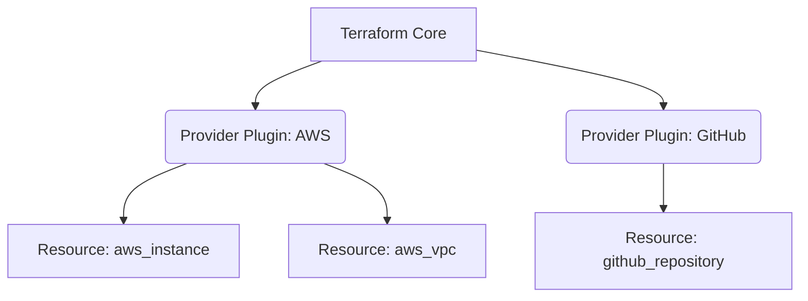

# Providers и Resources

## 📖 DevOps-история (Решение боли)
**Боль:** Ручное создание ресурсов в облаке приводит к "снежинкам" (snowflake servers), когда никто не помнит, кто, когда и зачем открыл порт 22 на всю сеть.
**Решение:** Описать инфраструктуру как код. `Provider` отвечает за то, *с кем* мы общаемся (AWS, GCP, Kubernetes), а `Resource` — за то, *что* мы создаем.

## 🏗 Архитектура (Mermaid)


## 💻 Примеры (HCL / Bash)

**Установка провайдера и создание ресурса (HCL):**
```hcl
terraform {
  required_providers {
    aws = {
      source  = "hashicorp/aws"
      version = "~> 5.0"
    }
  }
}

provider "aws" {
  region = "eu-central-1"
}

resource "aws_s3_bucket" "backup_storage" {
  bucket = "company-backups-2026"
  
  tags = {
    Environment = "Prod"
    Team        = "DevOps"
  }
}
```

**Инициализация (Bash):**
```bash
# Загрузка плагинов провайдеров
terraform init

# Проверка того, что будет создано
terraform plan
```

## 🛠 Day 2 Operations (Эксплуатация)
- **Обновление провайдера:** Периодически выполняйте `terraform init -upgrade` для получения патчей безопасности и новых фич провайдера, предварительно зафиксировав версию в `required_providers`.
- **Импорт существующих ресурсов:** Если ресурс создали руками, его можно забрать под управление Terraform с помощью `terraform import` (или блока `import {}` в последних версиях).
- **Удаление/Замена ресурса:** Команды `terraform taint` (устаревшая) или `terraform apply -replace="aws_instance.web"` для пересоздания сбойного ресурса.

## 🚫 Антипаттерны
- **Hardcode учетных данных в блоке provider:** Передавать Access Key / Secret Key прямо в коде. *Используйте переменные окружения (`AWS_ACCESS_KEY_ID`), роли IAM или OIDC.*
- **Использование latest-версий провайдеров:** Отсутствие фиксации версии (`version = "~> 5.0"`) приведет к тому, что мажорное обновление сломает ваш код.
- **Огромные монолитные state-файлы:** Запихивание тысяч ресурсов в один файл приведет к долгим `plan` и риску сломать всё разом. Дробите на логические модули и environments.
