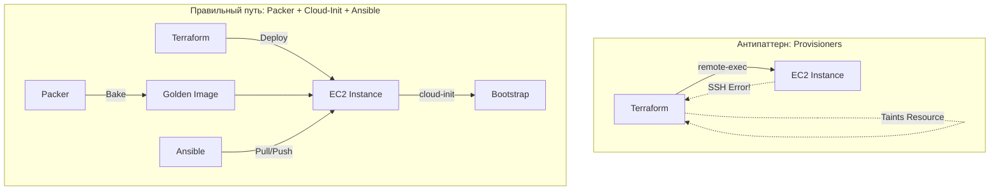

# Provisioners в Terraform / OpenTofu: Почему их стоит избегать

## История боли (Проблема)
Представьте: вы раскатываете пачку серверов. Для настройки каждого вы используете `remote-exec` provisioner, который по SSH заходит на инстанс и запускает bash-скрипт установки Nginx. Все идет отлично, пока на одном из серверов не рвется SSH-соединение (моргнула сеть). Terraform помечает ресурс как "tainted" (испорченный) и при следующем `apply` уничтожает сервер, чтобы пересоздать его с нуля, вместо того чтобы просто донастроить. В итоге деплой нестабилен, зависит от сети, и вы не можете разделить этап "поднять железо" от "настроить софт".

## Решение
Используйте специализированные инструменты для управления конфигурацией (Ansible, Chef, Puppet) или запекайте образы заранее (Packer). Для базовой инициализации (cloud-init / user-data) используйте встроенные возможности облачных провайдеров.

## Архитектура решения



## Примеры

### Антипаттерн (Не делайте так)
```hcl
resource "aws_instance" "web" {
  ami           = "ami-123456"
  instance_type = "t2.micro"

  provisioner "remote-exec" {
    inline = [
      "sudo apt-get update",
      "sudo apt-get install -y nginx"
    ]
  }
}
```

### Правильный подход (user-data / cloud-init)
```hcl
resource "aws_instance" "web" {
  ami           = data.aws_ami.golden_nginx.id # Образ предварительно собран Packer-ом
  instance_type = "t2.micro"

  # Базовая инициализация без SSH, выполняется самим облаком при старте
  user_data = <<-EOF
              #!/bin/bash
              systemctl enable nginx
              systemctl start nginx
              EOF
}
```

## Day 2 Operations
- **Траблшутинг:** Если скрипт настройки упал, сервер не пересоздается. Вы заходите, чините конфигурацию Ansible или обновляете образ в Packer.
- **Масштабирование:** Autoscaling группы (ASG) не могут использовать provisioners (Terraform не знает о новых инстансах). Запеченные образы (Golden Images) или cloud-init решают эту проблему идеально для динамических сред.
- **Идемпотентность:** Provisioners часто не идемпотентны. Повторный запуск скрипта может сломать систему. Terraform ожидает декларативного подхода.

## Антипаттерны
- **Использование `local-exec` для вызова Ansible:** `provisioner "local-exec" { command = "ansible-playbook..." }`. Terraform не отслеживает состояние Ansible. Лучше запускать Ansible отдельным шагом в CI/CD pipeline после `terraform apply`.
- **Зависимость от SSH-ключей в State:** Передача приватных ключей в provisioner повышает риски безопасности и захламляет код.
- **Destroy-time provisioners:** Использование `when = destroy` для очистки ресурсов (например, отписки от мониторинга). При сбоях это оставляет мусор в инфраструктуре.
