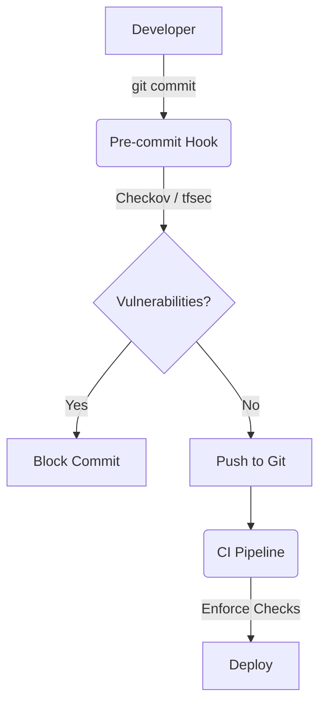

# Security (tfsec, checkov)

## 📖 История: Shift-Left Security (Решение боли)
**Боль:** Разработчики пишут Terraform-код, выкатывают S3-бакеты без шифрования или публичные базы данных. Security-команда узнает об этом через месяц после аудита, начинается долгий процесс remediation.
**Решение:** Использование статических анализаторов (**tfsec**, **Checkov**), которые сканируют IaC-код *до* его применения. Security сдвигается "влево" (Shift-Left) прямо в IDE и CI/CD, не давая несекьюрному коду попасть в master-ветку.

## 📐 Процесс проверки



## 💻 Примеры использования

### GitHub Actions (Checkov)
```yaml
name: Checkov
on: [push, pull_request]
jobs:
  checkov-job:
    runs-on: ubuntu-latest
    steps:
      - name: Checkout repo
        uses: actions/checkout@v3

      - name: Run Checkov action
        uses: bridgecrewio/checkov-action@master
        with:
          directory: ./terraform
          framework: terraform
          soft_fail: false # Упасть, если найдены уязвимости
```

### Игнорирование правил (Exceptions)
Иногда правило ложно срабатывает, или мы принимаем риск. Это фиксируется прямо в коде (Checkov):
```terraform
resource "aws_s3_bucket" "public_bucket" {
  bucket = "my-public-website"
  # checkov:skip=CKV_AWS_20:Бакет должен быть публичным для хостинга статики
}
```

## 🛠 Day 2 Operations (Эксплуатация)
- **Управление ложными срабатываниями:** Постоянная настройка политик. Важно не просто глушить ошибки, а использовать комментарии с обоснованием (skip/ignore).
- **Custom Policies:** По мере роста компании появляются внутренние стандарты (например, "все EC2 должны иметь тег CostCenter"). Checkov и tfsec (Trivy) позволяют писать кастомные правила на Python, Rego или YAML.
- **Обновление баз правил:** Обновляйте линтеры регулярно, чтобы они знали о новых сервисах и уязвимостях облачных провайдеров.

## ⛔ Антипаттерны
1. **Soft fail навсегда:** Настройка `soft_fail: true` (пропускать пайплайн при ошибках) в CI/CD как временное решение, которое становится постоянным. Уязвимости копятся.
2. **Слишком много шума:** Включение всех возможных проверок с первого дня, что вызывает ненависть разработчиков. Внедряйте проверки постепенно, начиная с критичных (Critical/High).
3. **Бесконтрольные skip-комментарии:** Разработчики ставят `checkov:skip` без валидации со стороны Security-команды. Требуется ревью PR для любых пропусков проверок.
