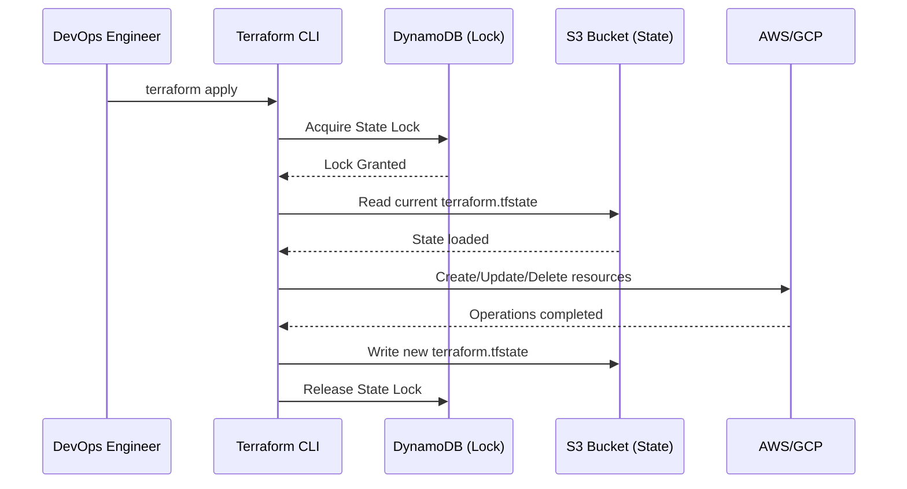

# Terraform и OpenTofu: State и Remote State

## История и Боль
**Боль:** Вы запустили `terraform apply` со своего ноутбука, а через час ваш коллега сделал то же самое. Terraform не знает о ресурсах друг друга, AWS-аккаунт превращается в кашу, а при попытке обновить ресурсы возникают конфликты. Локальный стейт-файл (`terraform.tfstate`) потерян из-за поломки диска.
**Решение:** Remote State (Удаленное состояние) с блокировками. Стейт хранится централизованно (S3, Consul, Terraform Cloud), а параллельные запуски предотвращаются механизмами блокировки (DynamoDB).

## Архитектура (Mermaid)


## Примеры

**Настройка Remote State в AWS (HCL):**
```hcl
terraform {
  backend "s3" {
    bucket         = "company-terraform-state-prod"
    key            = "network/vpc/terraform.tfstate"
    region         = "eu-central-1"
    encrypt        = true
    dynamodb_table = "terraform-state-lock"
  }
}
```

**Работа со стейтом (Bash):**
```bash
# Посмотреть список ресурсов в стейте
terraform state list

# Удалить ресурс из стейта (не удаляя из облака!)
terraform state rm aws_instance.web

# Подтянуть ресурс в стейт
terraform import aws_instance.web i-1234567890abcdef0
```

## Day 2 Operations
1. **Разделение стейтов:** Не храните всю инфраструктуру в одном огромном стейте. Разделяйте по слоям (Network, Data, App) и окружениям (Dev, Prod).
2. **Бэкап стейтов:** Включите версионирование (Versioning) на S3-бакете со стейтом. Это спасет от случайного `terraform destroy` или коррапции файла.
3. **Безопасность:** В стейте могут лежать секреты в открытом виде. Ограничьте доступ к бакету стейтов строгими IAM политиками.

## Антипаттерны
- **Хранение стейта в Git:** Добавление `terraform.tfstate` в репозиторий. Это приводит к конфликтам мерджа и утечке паролей, которые могут лежать в стейте.
- **Отключение блокировок:** Работа без `dynamodb_table` (или аналога). Риск коррапции стейта при одновременном запуске пайплайнов стремится к 100%.
- **Ручная правка стейта:** Редактирование JSON-файла `terraform.tfstate` руками вместо использования `terraform state` CLI.
