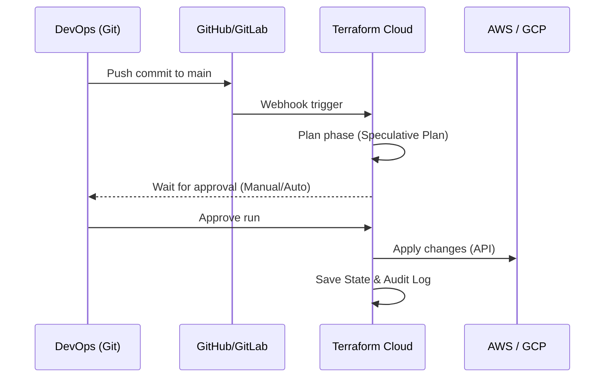

# Terraform Cloud (TFC)

## История боли (Проблема)
Команда из пяти DevOps-инженеров работает над одной инфраструктурой. Стейт-файл (`terraform.tfstate`) лежит в S3-бакете, локи в DynamoDB. Один инженер запускает `terraform apply` со своего ноутбука с устаревшей версией провайдера, другой параллельно пытается сделать то же самое. Возникают конфликты, секреты (AWS Keys) разбросаны по локальным машинам, а понять, кто и когда удалил базу данных, можно только перерыв логи в Slack или CI/CD. Локальный запуск `apply` стал бутылочным горлышком и угрозой безопасности.

## Решение
Terraform Cloud (или аналогичные решения типа Spacelift, Atlantis) переносит выполнение (Runs), хранение состояния (State) и управление секретами в облако. Запуски происходят централизованно, по триггерам из VCS (GitHub/GitLab), обеспечивая строгий аудит, контроль доступа и безопасное управление переменными.

## Архитектура решения



## Примеры

### Настройка бэкенда (CLI-driven run)
Интеграция с локальным CLI, но выполнение происходит в облаке.
```hcl
terraform {
  cloud {
    organization = "my-company-org"

    workspaces {
      name = "prod-infrastructure"
    }
  }
}
```

### CI/CD Pipeline (GitHub Actions - альтернатива VCS-driven)
Пример пайплайна, когда TFC используется для стейта/запусков, а триггер инициируется из GHA:
```yaml
name: "Terraform Apply"
on:
  push:
    branches:
      - main
jobs:
  terraform:
    runs-on: ubuntu-latest
    steps:
      - uses: actions/checkout@v3
      - uses: hashicorp/setup-terraform@v2
        with:
          cli_config_credentials_token: ${{ secrets.TF_API_TOKEN }}
      
      - name: Terraform Init
        run: terraform init
        
      - name: Terraform Apply
        run: terraform apply -auto-approve
```

## Day 2 Operations
- **Управление политиками (Sentinel / OPA):** Внедрение Policy-as-Code проверок безопасности *до* деплоя (например, запрет создания S3 без шифрования или лимит на стоимость ресурсов).
- **Управление доступом (RBAC):** Разработчики могут видеть логи или делать `plan` на своих ветках, но только лиды могут делать `apply` в production-воркспейс.
- **Дрифты (Drift Detection):** TFC может регулярно проверять инфраструктуру на наличие изменений, сделанных руками мимо Terraform (ClickOps).

## Антипаттерны
- **Хранение секретов в коде:** Даже если используется TFC, не хардкодьте ключи в `.tf` файлах. В TFC есть Workspace Variables (в режиме Sensitive).
- **Один огромный Workspace:** Разделяйте инфраструктуру на логические куски (сеть, базы, приложения) в разные воркспейсы. Это уменьшает радиус поражения (blast radius) и ускоряет `plan`/`apply`.
- **Игнорирование версий:** Не фиксировать версию Terraform в настройках воркспейса TFC. Это приведет к непредсказуемым обновлениям и синтаксическим ошибкам, когда локальный CLI и облачный TFC разъедутся по мажорным версиям.
