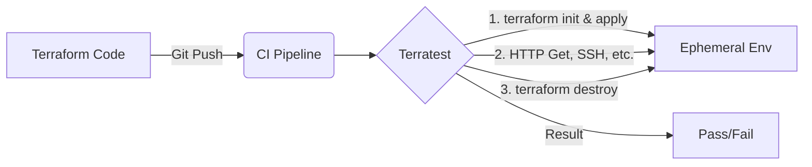

# Testing (Terratest)

## 📖 История: От страха к уверенности (Решение боли)
**Боль:** Инфраструктура разворачивается через Terraform без ошибок, но приложения падают из-за неправильных Security Group, отсутствующих маршрутов или неверных прав IAM. Ошибки обнаруживаются только на проде.
**Решение:** Автоматизированное end-to-end тестирование инфраструктуры с помощью **Terratest**. Мы разворачиваем реальную инфраструктуру, проверяем её работоспособность (например, делаем HTTP-запрос или проверяем подключение к БД) и затем уничтожаем её.

## 📐 Архитектура тестирования



## 💻 Примеры использования

### Go (Terratest)
```go
package test

import (
	"testing"
	"github.com/gruntwork-io/terratest/modules/terraform"
	"github.com/stretchr/testify/assert"
)

func TestTerraformAwsHelloWorld(t *testing.T) {
	terraformOptions := terraform.WithDefaultRetryableErrors(t, &terraform.Options{
		TerraformDir: "../examples/hello-world",
	})

	// Очистка после теста
	defer terraform.Destroy(t, terraformOptions)

	// Развертывание
	terraform.InitAndApply(t, terraformOptions)

	// Проверка
	output := terraform.Output(t, terraformOptions, "hello_world")
	assert.Equal(t, "Hello, World!", output)
}
```

### GitLab CI (Запуск тестов)
```yaml
terratest:
  stage: test
  image: golang:1.20
  script:
    - cd tests
    - go mod init test || true
    - go mod tidy
    - go test -v -timeout 30m
```

## 🛠 Day 2 Operations (Эксплуатация)
- **Управление временем выполнения:** Инфраструктурные тесты идут долго (десятки минут). Необходимо настраивать таймауты (`-timeout 30m`) и запускать их в параллель, где это возможно.
- **Очистка ресурсов:** Если CI падает, `defer terraform.Destroy` может не сработать. Внедрите сборщик мусора (например, `cloud-nuke`), чтобы удалять "повисшие" тестовые ресурсы.
- **Управление стейтом:** Для тестов часто используют локальный стейт или генерируют уникальные имена ресурсов, чтобы тесты могли бегать параллельно без конфликтов.

## ⛔ Антипаттерны
1. **Тестирование ради тестирования:** Проверка того, что "AWS создал S3 бакет". AWS это уже протестировал. Проверяйте *поведение* вашей связки (например, может ли EC2 достучаться до S3).
2. **Отсутствие изоляции:** Запуск тестов в том же аккаунте или VPC, где живет production. Ошибка в тесте не должна влиять на рабочие системы.
3. **Игнорирование очистки:** Накопление мусора в тестовом облаке, что приводит к гигантским счетам за инфраструктуру.
