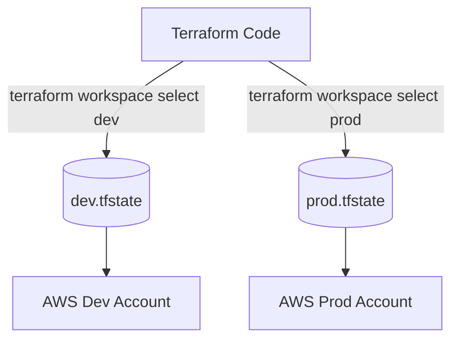

# Terraform Workspaces

## 📖 История: Боль и Решение
**Боль:** Команда выкатывает инфраструктуру для `dev`, `stage` и `prod`. Код копипастится по разным папкам, `tfstate` путается, кто-то случайно применил изменения `dev` на `prod`.
**Решение:** **Terraform Workspaces** (или OpenTofu Workspaces). Позволяют использовать один и тот же код для разных окружений, разделяя состояния (state).

## 🏗 Архитектура



## 💻 Примеры

**Bash: Работа с workspaces**
```bash
# Создать новый workspace
terraform workspace new stage

# Посмотреть текущий список
terraform workspace list

# Переключиться на другой workspace
terraform workspace select prod
```

**Terraform: Использование в коде**
В коде можно ссылаться на текущий workspace через `terraform.workspace`.

```hcl
resource "aws_s3_bucket" "app_data" {
  bucket = "my-app-data-${terraform.workspace}"

  tags = {
    Environment = terraform.workspace
  }
}

locals {
  instance_count = terraform.workspace == "prod" ? 3 : 1
}
```

## 🛠 Day 2 Operations
- **Миграция стейта:** Если workspace разросся, и вы хотите перенести его в отдельный бэкенд, потребуется `terraform state pull` и аккуратная работа с `terraform init -reconfigure`.
- **Интеграция CI/CD:** В пайплайнах (GitLab CI, GitHub Actions) всегда явно задавайте workspace перед `terraform plan/apply`.

**Пример GitLab CI:**
```yaml
deploy_prod:
  stage: deploy
  script:
    - terraform init
    - terraform workspace select prod || terraform workspace new prod
    - terraform apply -auto-approve
  environment:
    name: production
```

## 🚫 Антипаттерны
- **Использование workspaces для совершенно разной инфраструктуры:** Workspaces подходят только если архитектура `dev` и `prod` идентична (разница лишь в размерах инстансов или количестве). Если инфраструктура отличается, лучше использовать Terragrunt или разные директории.
- **Хранение секретов в коде с if-else по workspace:** Не завязывайте пароли на `terraform.workspace == "prod"`. Используйте переменные из внешнего хранилища (Vault, AWS Secrets Manager) или инжектите их через переменные окружения.
