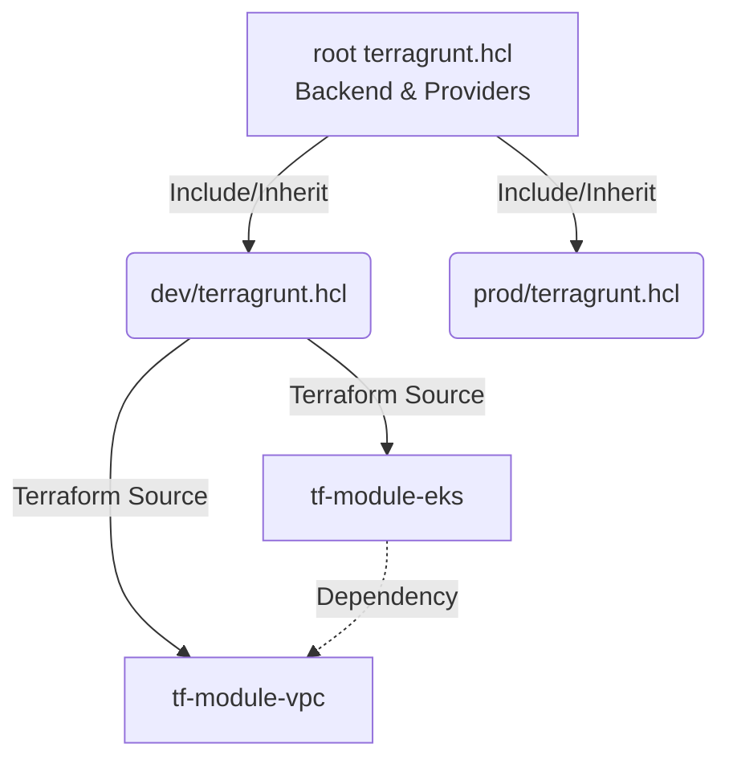

# Terragrunt

## 📖 История из жизни (Решение боли)
**Боль:** По мере роста инфраструктуры, команде пришлось дублировать код настройки `backend` (S3/DynamoDB) и провайдеров во множестве Terraform-директорий (dev, stage, prod, vpc, eks, rds). При изменении версии провайдера или региона приходилось делать Find/Replace по десяткам файлов. Запуск применения всей инфраструктуры превратился в мучительный последовательный ручной процесс.
**Решение:** **Terragrunt** — тонкая обертка над Terraform, реализующая принцип DRY (Don't Repeat Yourself). Он позволяет вынести общие конфигурации (бэкенды, провайдеры) в родительский файл и наследовать их, а также управлять зависимостями между модулями (например, VPC должен создаться до EKS).

## 📊 Архитектура (Terragrunt DRY & Dependencies)



## 💻 Примеры

### Родительский конфигурационный файл (`root/terragrunt.hcl`)
```hcl
# Автоматическая генерация конфигурации backend
remote_state {
  backend = "s3"
  generate = {
    path      = "backend.tf"
    if_exists = "overwrite_terragrunt"
  }
  config = {
    bucket         = "my-terraform-state-${path_relative_to_include()}"
    key            = "terraform.tfstate"
    region         = "eu-central-1"
    encrypt        = true
    dynamodb_table = "terraform-locks"
  }
}
```

### Дочерний конфигурационный файл (`root/dev/vpc/terragrunt.hcl`)
```hcl
# Наследуем конфигурацию из корня
include "root" {
  path = find_in_parent_folders()
}

# Указываем, откуда брать сам модуль Terraform
terraform {
  source = "git::git@github.com:my-org/terraform-aws-vpc.git//.?ref=v1.0.0"
}

# Передаем переменные, специфичные для окружения
inputs = {
  environment = "dev"
  cidr_block  = "10.0.0.0/16"
}
```

## 🛠 Day 2 Operations
- **Run-all:** Использование команд `terragrunt run-all plan` и `terragrunt run-all apply` для развертывания или обновления сразу нескольких компонентов инфраструктуры с учетом графа зависимостей между ними.
- **Dependency Management:** Блоки `dependency` позволяют передавать output-значения из одного модуля в качестве input-значений для другого (например, `vpc_id` из модуля VPC в модуль базы данных).
- **Кэширование:** Terragrunt кэширует скачанные модули в директории `.terragrunt-cache`, что ускоряет повторные запуски, но иногда требует очистки при смене веток или отладке.

## ⚠️ Антипаттерны
1. **Перегруженность логикой:** Попытки писать сложную логику, циклы и функции генерации строк внутри `terragrunt.hcl`. Terragrunt должен оставаться максимально простым маршрутизатором переменных, вся логика должна быть внутри Terraform.
2. **Глубокая вложенность:** Создание слишком сложной иерархии папок и файлов `terragrunt.hcl`, в которой становится невозможно отследить, откуда приходят значения переменных (Include hell).
3. **Зависимость от локальных путей:** Использование локальных путей для Terraform модулей (`source = "../../../modules/vpc"`) вместо версионированных Git-тегов. Это убивает воспроизводимость окружений и усложняет откаты (Rollbacks).
