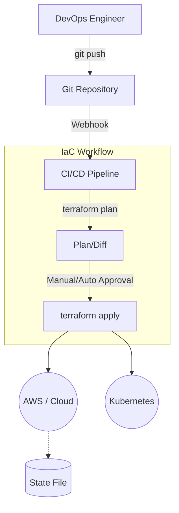

# Принципы Infrastructure as Code (IaC)

## 📖 История и Боль
**Боль:** Команда потратила три дня, чтобы вручную накликать в AWS-консоли (ClickOps) тестовое окружение, похожее на production. Через месяц выяснилось, что забыли настроить Security Group, из-за чего сервис упал. При попытке повторить это для staging-окружения процесс занял еще больше времени, а конфигурации окружений разъехались (Configuration Drift).
**Решение:** Относиться к инфраструктуре как к программному коду (IaC). Мы описываем серверы, сети и базы данных в текстовых файлах (Terraform, Ansible), версионируем их в Git и раскатываем через CI/CD. Теперь поднятие копии production занимает 5 минут.

## 📊 Схема (Mermaid)


## 💻 Пример (Terraform)
Декларативное описание AWS EC2 инстанса с помощью Terraform.

```hcl
# main.tf
provider "aws" {
  region = "eu-central-1"
}

resource "aws_instance" "web" {
  ami           = "ami-0c55b159cbfafe1f0"
  instance_type = "t3.micro"

  tags = {
    Name        = "Frontend-Server"
    Environment = "Production"
  }
}
```

```bash
# Типичный workflow применения IaC
terraform init                # Инициализация провайдеров
terraform plan -out=tfplan    # Просмотр изменений до их применения
terraform apply "tfplan"      # Фактическое применение изменений к облаку
```

## 🛠 Day 2 Operations (Эксплуатация)
1. **Remote State & Locking:** Состояние (State) должно храниться в удаленном защищенном хранилище (например, S3) с блокировками (DynamoDB), чтобы два инженера не запустили `apply` одновременно и не разрушили инфраструктуру.
2. **Drift Detection:** Настройте регулярный запуск `terraform plan` по крону. Если он показывает изменения, значит кто-то внес ручные правки в консоли (возник дрейф конфигурации), о чем нужно немедленно прислать алерт.
3. **Модульность:** Выносите повторяющийся код (например, создание VPC со всеми подсетями) в переиспользуемые модули, чтобы соблюдать принцип DRY.

## 🚫 Антипаттерны
- **ClickOps:** Внесение изменений напрямую через веб-интерфейс облачного провайдера. Эти изменения будут затерты при следующем запуске IaC, или сломают пайплайн.
- **Секреты в репозитории:** Хранение паролей от БД или API-ключей в открытом виде прямо в коде. Используйте интеграции с Vault, AWS Secrets Manager или хотя бы зашифрованные переменные CI.
- **Императивный подход вместо декларативного:** Написание длинных bash-скриптов для создания инфраструктуры вместо использования специализированных IaC-инструментов. Скрипты сложно поддерживать и они не умеют в идемпотентность.
