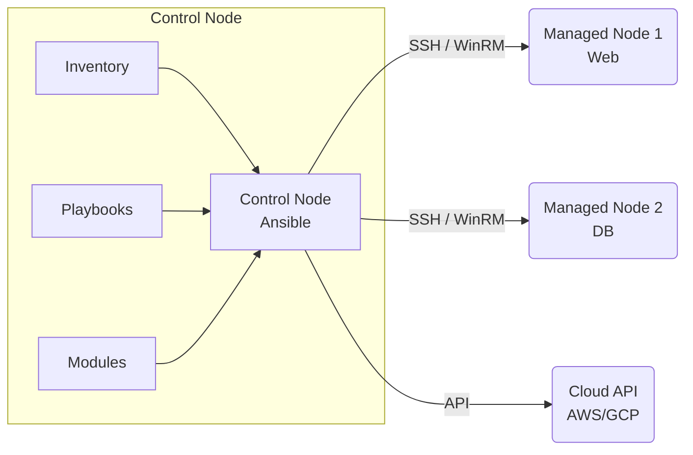

# 00 Основы Ansible

## DevOps Story: Боль и Решение
**Боль:** Сервера настраивались руками ("снежинки"). Админ ушел в отпуск, сервер упал, никто не знает, какие пакеты там стояли и где лежали конфиги. Баш-скрипты разрослись до нечитаемого состояния и ломались на идемпотентности.
**Решение:** Ansible. Никаких агентов, только SSH. Инфраструктура описана как код (IaC) в читаемом YAML-формате. Идемпотентность "из коробки" — запускай сколько хочешь, состояние придет к желаемому без побочных эффектов.

## Архитектура



## Примеры

**Bash (установка на Control Node):**
```bash
python3 -m pip install --user ansible
ansible --version
```

**YAML (Простой Playbook - `site.yml`):**
```yaml
---
- name: Setup Web Servers
  hosts: webservers
  become: yes
  tasks:
    - name: Ensure Nginx is installed
      apt:
        name: nginx
        state: present
        update_cache: yes

    - name: Ensure Nginx is running
      service:
        name: nginx
        state: started
        enabled: yes
```

## Day 2 Operations (Советы)
- **Идемпотентность — ваше всё:** Всегда пишите таски так, чтобы повторный запуск ничего не ломал и не вызывал статус `changed`, если система уже в нужном состоянии.
- **Ansible Lint & Syntax Check:** Всегда используйте `ansible-lint` в CI/CD пайплайнах перед применением.
- **Dry Run:** Запускайте плейбуки с флагом `--check` и `--diff`, чтобы увидеть, что изменится, прежде чем реально что-то менять.

## Антипаттерны
- **Использование `command` и `shell` вместо модулей:** Не пишите `shell: apt-get install nginx`, используйте модуль `apt`.
- **Свалка в одном плейбуке:** Не пишите монолитные плейбуки на 1000 строк. Разбивайте логику на Roles (Роли) с помощью `ansible-galaxy`.
- **Хранение секретов в plain text:** Всегда используйте `ansible-vault` для паролей, токенов и ключей.
