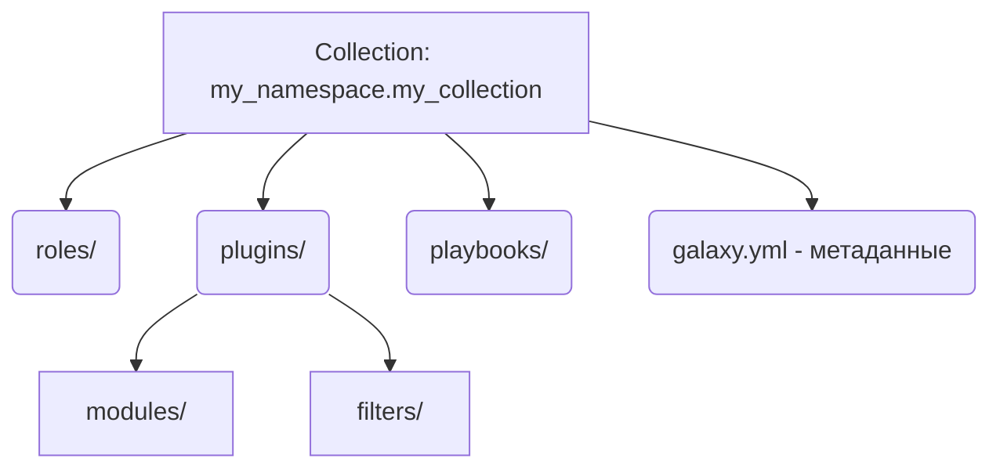

# Collections

## 📖 История: Хаос в зависимостях

**Боль:** Мы использовали десятки сторонних ролей из Ansible Galaxy и писали свои кастомные модули на Python. Модули валялись в папке `library/`, роли подтягивались через `requirements.yml`. Но когда мы решили переиспользовать наши модули и плагины в другом проекте, начался ад с копипастой. Версионировать связку "роль + нужный для неё кастомный модуль" было мучением.

**Решение:** Ansible Collections. Это стандартный формат распространения, который упаковывает роли, модули, плагины и даже playbooks в единый архив (tarball). Мы собрали нашу инфраструктурную логику в одну коллекцию `mycompany.infra`, залили её на внутренний Automation Hub и просто подключаем как одну зависимость.

## 🏗 Структура Коллекции



## 💻 Примеры

### Установка коллекции (requirements.yml)
```yaml
collections:
  - name: awx.awx
    version: "21.11.0"
  - name: https://github.com/myorg/my_collection.git
    type: git
    version: v1.0.0
```
Установка: `ansible-galaxy collection install -r requirements.yml`

### Использование в Playbook (с FQCN)
*FQCN = Fully Qualified Collection Name*
```yaml
- name: Manage AWS resources
  hosts: localhost
  tasks:
    - name: Create a VPC
      amazon.aws.ec2_vpc_net: # Использование модуля из коллекции
        name: my_vpc
        cidr_block: 10.0.0.0/16
```

### Создание своей коллекции
```bash
ansible-galaxy collection init my_namespace.my_collection
```

## 🛠 Day 2 Operations

*   **Private Automation Hub:** Поднимите свой реестр коллекций (например, Ansible Galaxy NG или Sonatype Nexus), чтобы не зависеть от публичного Galaxy и безопасно хранить проприетарные коллекции.
*   **Execution Environments:** Упаковывайте коллекции вместе с нужными Python-библиотеками в контейнеры (Ansible Builder) для запуска через Ansible Navigator или AWX.
*   **Strict FQCN:** Всегда используйте полные имена (например, `ansible.builtin.apt`, а не просто `apt`). Это ускоряет работу Ansible (не нужно искать модуль) и защищает от конфликтов имён.

## ⚠️ Антипаттерны

*   **Раздутые коллекции:** Попытка засунуть всё IT-хозяйство компании в одну гигантскую коллекцию `company.all`. Лучше дробить по доменам: `company.network`, `company.db`.
*   **Ручные релизы:** Сборка коллекции (`ansible-galaxy collection build`) и публикация руками с ноутбука инженера. Настройте CI/CD пайплайн (GitHub Actions/GitLab CI) для релиза коллекций при создании Git-тега.
*   **Свалка в плагинах:** Хранение неиспользуемых или сломанных кастомных модулей в коллекции "на всякий случай".
