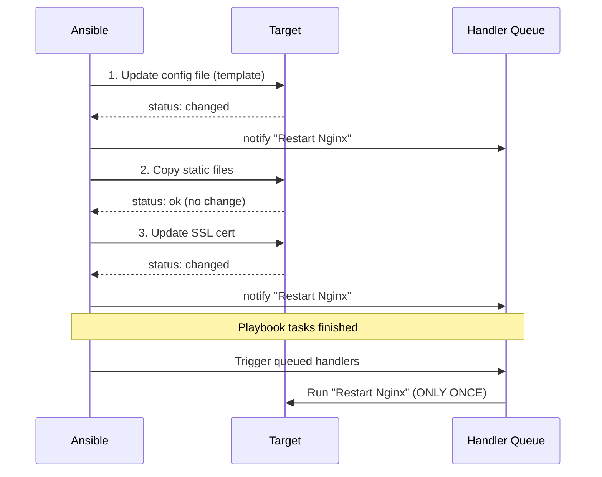

# Ansible: Handlers (Обработчики)

## История из жизни: Боль и Решение

**Боль:** При обновлении конфигурации Nginx или базы данных мы просто добавляли таску `service: name=nginx state=restarted`. Проблема в том, что Ansible идемпотентен, но такая таска перезапускала сервис при *каждом* запуске плейбука, даже если конфиг не менялся. Это приводило к микро-даунтаймам при регулярных прогонах.

**Решение:** **Handlers (Обработчики)**. Это специальные таски, которые выполняются *только* в том случае, если другая таска изменила состояние системы (статус `changed`). Более того, даже если несколько тасок вызовут один и тот же хендлер, он отработает только один раз в самом конце выполнения плейбука.

## Как работают Handlers



## Примеры конфигураций

### 1. Триггер хендлера из таски (notify)
```yaml
tasks:
  - name: Deploy Nginx configuration
    template:
      src: nginx.conf.j2
      dest: /etc/nginx/nginx.conf
    notify:
      - Reload Nginx
```

### 2. Описание хендлера (handlers/main.yml)
```yaml
handlers:
  - name: Reload Nginx
    service:
      name: nginx
      state: reloaded

  - name: Restart Application
    systemd:
      name: myapp
      state: restarted
      daemon_reload: yes
```

### 3. Использование listen (для группировки)
```yaml
tasks:
  - name: Update SSL certificate
    copy:
      src: cert.pem
      dest: /etc/ssl/cert.pem
    notify: update_web_certs

handlers:
  - name: Reload Nginx
    service: name=nginx state=reloaded
    listen: update_web_certs

  - name: Restart HAProxy
    service: name=haproxy state=restarted
    listen: update_web_certs
```

## Day 2 Operations (Советы по эксплуатации)
1. **Force Handlers:** По умолчанию, если таска упадет (fail), хендлеры не выполнятся. Используйте `--force-handlers` при запуске `ansible-playbook` (или `force_handlers: yes` в `ansible.cfg`), чтобы хендлеры отработали даже при падении плейбука.
2. **Flush Handlers:** Хендлеры выполняются в конце пьесы (play). Если вам нужно применить изменения (например, запустить сервис) до окончания плейбука, используйте мета-таску `meta: flush_handlers`.
3. **Reload vs Restart:** Всегда предпочитайте `reloaded` (обновление конфига без обрыва соединений) вместо `restarted`, если сервис это поддерживает.

## Антипаттерны ❌
- **Использование хендлеров для линейной логики:** Хендлеры не предназначены для того, чтобы быть просто "вынесенными функциями". Если таска *всегда* должна выполняться после другой таски, просто напишите их друг за другом.
- **Несовпадение имен:** Опечатка в имени хендлера в секции `notify` приведет к ошибке выполнения плейбука. Используйте `listen` для создания абстрактных "событий" вместо привязки к конкретному имени таски.
- **Цепочки хендлеров:** Хендлер, который делает `notify` другому хендлеру. Это делает логику непрозрачной и сложной для отладки.
