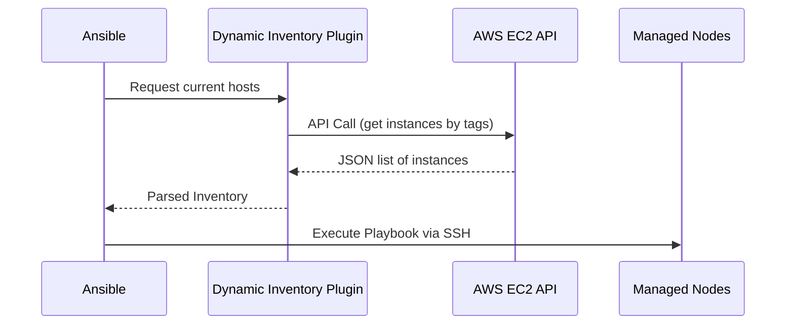

# Inventory и Dynamic Inventory в Ansible

## DevOps Story: Боль и Решение
**Боль:** Облачная инфраструктура динамична: автоскейлинг поднимает и убивает десятки машин каждый день. Поддерживать статический `hosts.ini` файл руками стало невозможно — скрипты развертывания постоянно падали, пытаясь подключиться к мертвым инстансам.
**Решение:** Dynamic Inventory. Ansible может динамически опрашивать API облачного провайдера (AWS, GCP, VMware) и формировать актуальный список хостов прямо перед запуском плейбука.

## Как это работает



## Примеры

**Статический Inventory (INI формат):**
```ini
[webservers]
web-01.example.com
web-02.example.com

[databases]
db-master.example.com

[all:vars]
ansible_user=ubuntu
ansible_ssh_private_key_file=~/.ssh/id_rsa
```

**Dynamic Inventory (AWS EC2 Plugin YAML - `aws_ec2.yml`):**
```yaml
plugin: aws_ec2
regions:
  - us-east-1
filters:
  instance-state-name: running
keyed_groups:
  - key: tags.Environment
    prefix: env
  - key: tags.Role
    prefix: role
```

**Bash (Проверка Inventory):**
```bash
ansible-inventory -i aws_ec2.yml --graph
ansible all -i aws_ec2.yml -m ping
```

## Day 2 Operations (Советы)
- **Группировка по тегам:** В динамических инвентарях активно используйте `keyed_groups`. Это позволяет нацеливать плейбуки на группы вроде `env_prod` или `role_web`.
- **Кэширование:** Динамические инвентари могут долго опрашивать большие облака. Включайте кэширование (например, Redis или JSON файлы), чтобы ускорить запуск плейбуков: `cache: yes`.
- **Разделение окружений:** Используйте отдельные директории инвентарей для `prod`, `stage`, `dev`, чтобы случайно не запустить плейбук не там.

## Антипаттерны
- **Использование кастомных bash/python скриптов для Dynamic Inventory:** Раньше это было нормой, но сейчас лучше использовать официальные Inventory Plugins, они быстрее, безопаснее и поддерживаются комьюнити.
- **Хардкод IP адресов в плейбуках:** Никогда не пишите IP-адреса прямо в тасках (например, `delegate_to: 192.168.1.100`). Используйте имена хостов или переменные из инвентаря.
- **Отсутствие тэгов на ресурсах:** Динамический инвентарь бесполезен, если инстансы в облаке не размечены понятными тегами (Role, Environment, Project).
