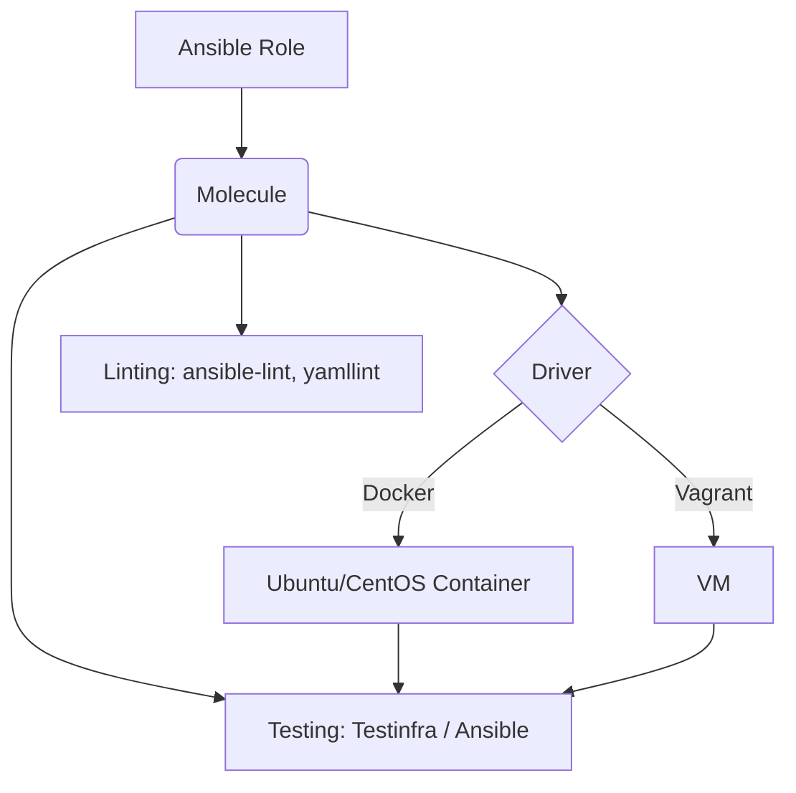

# Molecule: Тестирование Ansible ролей

## История: Боль и Решение
**Боль:** Команда написала десяток Ansible-ролей. Всё работало на dev-окружении, но при деплое на prod-сервера с другой версией ОС (CentOS вместо Ubuntu) половина ролей упала. Конфиги ломались, сервисы не стартовали. Разработчики тратили часы на ручное поднятие виртуалок для проверки каждой роли.
**Решение:** Внедрение Molecule. Теперь каждая роль тестируется в изолированных контейнерах (Docker) или виртуалках (Vagrant) на разных ОС перед мерджем в master. Сценарии проверяют идемпотентность и корректность работы сервисов с помощью Testinfra (или Ansible verifier).

## Архитектура Molecule



## Примеры конфигураций

### 1. Инициализация роли с Molecule
```bash
# Инициализация новой роли с поддержкой Molecule (драйвер docker)
molecule init role my_role --driver-name docker
```

### 2. molecule.yml (Конфигурация драйвера и платформы)
```yaml
---
dependency:
  name: galaxy
driver:
  name: docker
platforms:
  - name: instance-ubuntu
    image: geerlingguy/docker-ubuntu2204-ansible:latest
    command: ""
    volumes:
      - /sys/fs/cgroup:/sys/fs/cgroup:rw
    cgroupns_mode: host
    privileged: true
    pre_build_image: true
provisioner:
  name: ansible
verifier:
  name: testinfra
```

### 3. test_default.py (Testinfra)
```python
# tests/test_default.py
import os
import testinfra.utils.ansible_runner

testinfra_hosts = testinfra.utils.ansible_runner.AnsibleRunner(
    os.environ['MOLECULE_INVENTORY_FILE']
).get_hosts('all')

def test_nginx_is_installed(host):
    nginx = host.package("nginx")
    assert nginx.is_installed

def test_nginx_running_and_enabled(host):
    nginx = host.service("nginx")
    assert nginx.is_running
    assert nginx.is_enabled
```

## Day 2 Operations (Советы по эксплуатации)
1. **Матрица тестирования в CI/CD:** Настройте GitHub Actions или GitLab CI для запуска `molecule test` на каждый Pull Request. Тестируйте на всех поддерживаемых в проде дистрибутивах.
2. **Кэширование образов:** Используйте pre-built образы (например, от `geerlingguy`), чтобы не тратить время на установку Ansible и systemd внутри контейнеров при каждом прогоне.
3. **Идемпотентность:** Molecule по умолчанию проверяет идемпотентность (повторный запуск роли не должен вносить изменений). Всегда добивайтесь прохождения этого шага, избегая `command`/`shell` без `creates`/`removes`.
4. **Уборка мусора и отладка:** Если тесты упали, команда `molecule test` удалит окружение по умолчанию. Для отладки используйте `molecule converge`, чтобы применить роль, и `molecule login` для захода в контейнер. Затем можно запустить тесты через `molecule verify` и очистить всё через `molecule destroy`.

## Антипаттерны
- ❌ **Игнорирование проверки идемпотентности:** Отключение `idempotence` в сценарии Molecule — прямой путь к непредсказуемым изменениям на серверах.
- ❌ **Тестирование только "счастливого пути":** Не проверять, что роль корректно фейлится при неверных входных переменных (negative testing).
- ❌ **Использование сложных проверок в Ansible:** Попытка написать сложные тесты состояния через модули `uri`, `command` и `assert` внутри самого Ansible, вместо использования специализированных фреймворков вроде Testinfra или Goss.
- ❌ **Тяжеловесные драйверы для простых ролей:** Использование Vagrant (VM) там, где достаточно Docker. Docker-контейнеры стартуют за секунды, виртуалки — за минуты.
