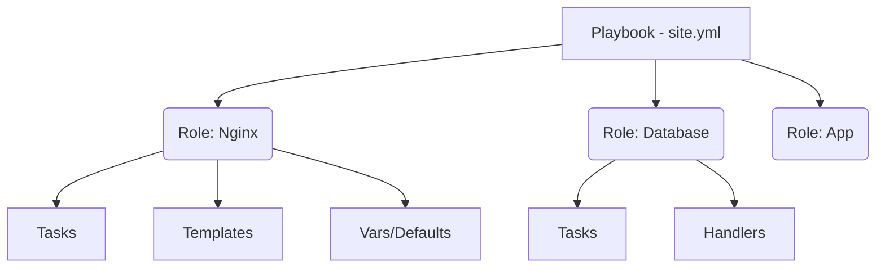

# Playbooks и Roles

## 📖 История: От лапши к кубикам Lego

**Боль:** В начале всё было просто — один YAML-файл, накатывающий Nginx и базу данных. Но проект рос. Playbook раздулся до 3000 строк. Найти в нём нужную таску стало невозможно. При попытке обновить версию PHP на одном сервере, ломались другие. Код дублировался из проекта в проект (Ctrl+C, Ctrl+V). 

**Решение:** Переход на Roles. Мы разрезали огромный playbook на логические компоненты (роли) — `nginx`, `php`, `mysql`. Теперь каждый компонент — это независимый кубик со своими тасками, переменными и шаблонами. Playbook стал просто тонкой обёрткой, вызывающей нужные роли.

## 🏗 Архитектура



## 💻 Примеры

### Плохо: Гигантский Playbook
```yaml
- name: Setup Web Server
  hosts: web
  tasks:
    - name: Install Nginx
      apt: name=nginx state=latest
    - name: Copy config
      template: src=nginx.conf.j2 dest=/etc/nginx/nginx.conf
    # ... еще 1000 строк
```

### Хорошо: Playbook с Ролями (site.yml)
```yaml
- name: Setup Web Server
  hosts: web
  roles:
    - common
    - nginx
    - php-fpm
```

### Создание новой роли
```bash
ansible-galaxy init my_new_role
```

## 🛠 Day 2 Operations

*   **Версионирование ролей:** Храните каждую роль в отдельном Git-репозитории. Подключайте их через `requirements.yml` с указанием конкретной версии (тега).
*   **Тестирование:** Используйте Molecule для тестирования ролей в изоляции (в Docker или Vagrant). Это спасёт от сюрпризов при деплое.
*   **Идемпотентность:** Роль должна отрабатывать одинаково безопасно хоть один раз, хоть сотню раз.

## ⚠️ Антипаттерны

*   **God Role:** Роль, которая делает всё (и ставит базу, и настраивает сеть, и деплоит код). Роль должна иметь одну зону ответственности (Single Responsibility Principle).
*   **Зашитые секреты:** Хранение паролей прямо в `vars/main.yml`. Всегда используйте Ansible Vault или интеграцию с HashiCorp Vault.
*   **Игнорирование Defaults:** Хардкодинг значений в тасках вместо использования `defaults/main.yml`, что делает роль непереиспользуемой.
