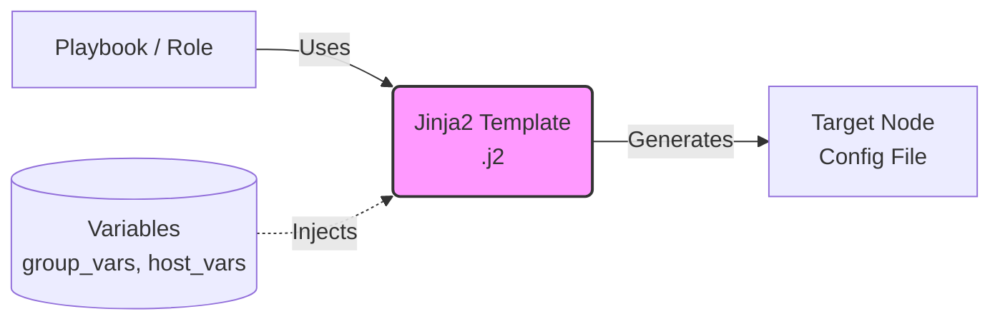

# Ansible: Variables и Templates (Jinja2)

## История из жизни: Боль и Решение

**Боль:** В начале пути мы хардкодили IP-адреса, порты и пароли прямо в тасках (tasks). При переезде со `staging` на `production` приходилось делать массовую автозамену, из-за чего часто ломались конфиги, а пароли светились в Git. Настройка каждого нового окружения превращалась в мучительный поиск "где еще мы забыли поменять значение".

**Решение:** Разделение логики и данных. Логика остается в плейбуках/ролях, а данные выносятся в **Переменные (Variables)**. Для генерации конфигурационных файлов используются **Шаблоны (Templates)** на базе движка Jinja2, куда эти переменные подставляются "на лету" прямо перед отправкой на целевой сервер.

## Архитектура работы с шаблонами



## Примеры конфигураций

### 1. Определение переменных (group_vars/webservers.yml)
```yaml
---
nginx_port: 8080
app_domain: api.example.com
worker_processes: 4
db_connection_string: "postgres://user:{{ db_password }}@db.example.com/prod"
```

### 2. Шаблон Jinja2 (templates/nginx.conf.j2)
```jinja2
# Автоматически сгенерировано Ansible!
server {
    listen {{ nginx_port }};
    server_name {{ app_domain }};

    worker_processes {{ worker_processes | default(1) }};

    location / {
        proxy_pass http://backend;
        
        add_header Strict-Transport-Security "max-age=31536000";
        
    }
}
```

### 3. Использование в Playbook
```yaml
- name: Deploy Nginx Config
  template:
    src: templates/nginx.conf.j2
    dest: /etc/nginx/sites-available/default
    owner: root
    group: root
    mode: '0644'
  notify: restart nginx
```

## Day 2 Operations (Советы по эксплуатации)
1. **Иерархия переменных:** Всегда помните про [Variable Precedence](https://docs.ansible.com/ansible/latest/user_guide/playbooks_variables.html#variable-precedence-where-should-i-put-a-variable). Старайтесь держать переменные в `group_vars/` и `host_vars/`.
2. **Секреты:** Все пароли и токены храните в зашифрованном виде с помощью `ansible-vault`.
3. **Фильтры Jinja2:** Активно используйте встроенные фильтры (например, `| default('value')`, `| to_json`, `| b64decode`). Это сильно упрощает логику в шаблонах.

## Антипаттерны ❌
- **Разбрасывание переменных по всему проекту:** Определение переменных одновременно в inventory, playbooks (`vars:`), roles (`defaults/` и `vars/`) и extra-vars (`-e`). Это превращает дебаг в ад.
- **Слишком много логики в шаблонах:** Jinja2 поддерживает циклы `` и условия ``, но если ваш шаблон выглядит как программа на Python, лучше вынести логику в кастомный модуль или фильтр Ansible.
- **Отсутствие комментариев о генерации:** Если не написать в начале шаблона `# Managed by Ansible`, кто-нибудь обязательно исправит конфиг руками на сервере, и при следующем прогоне Ansible эти изменения затрутся.
