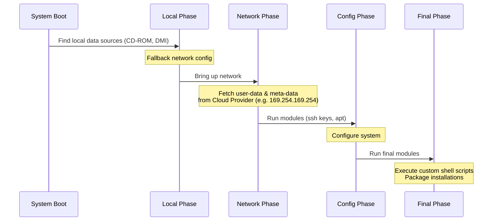

# Cloud-Init

## История: Боль и Решение
**Боль:** У нас есть "золотой образ" (Golden Image), но при запуске 10 одинаковых виртуальных машин нам нужно дать им разные имена хостов, разные IP-адреса, прокинуть уникальные SSH-ключи или передать специфичные переменные окружения. Заходить на каждую ВМ руками для персонализации — это смерть автоматизации.
**Решение:** [Cloud-Init](https://cloudinit.readthedocs.io/) — индустриальный стандарт для кросс-платформенной инициализации облачных инстансов. При первой загрузке виртуальной машины Cloud-Init обращается к метаданным провайдера (AWS, GCP, OpenStack, Proxmox), забирает пользовательские скрипты (user-data) и выполняет "последнюю милю" конфигурации без вмешательства человека.

## Архитектура и Фазы Загрузки

Cloud-Init работает в несколько этапов во время загрузки ОС.



## Примеры конфигураций (Cloud-Config YAML)

Формат `#cloud-config` — это YAML-файл, который передается как `user-data` при создании инстанса (например, через Terraform или AWS CLI).

```yaml
#cloud-config

# 1. Установка hostname
hostname: web-server-01
fqdn: web-server-01.internal.example.com
manage_etc_hosts: true

# 2. Управление пользователями и SSH ключами
users:
  - name: devops
    groups: sudo
    shell: /bin/bash
    sudo: ['ALL=(ALL) NOPASSWD:ALL']
    ssh_import_id:
      - gh:injurka
    ssh_authorized_keys:
      - ssh-rsa AAAAB3NzaC1yc2EAAAADAQABAAABAQ... user@domain

# 3. Обновление пакетов и установка новых
package_update: true
package_upgrade: true
packages:
  - htop
  - curl
  - jq
  - docker.io

# 4. Выполнение произвольных команд (runcmd)
runcmd:
  - [ systemctl, enable, docker ]
  - [ systemctl, start, docker ]
  - echo "Instance initialized on $(date)" > /etc/motd
```

Пример передачи `user-data` через Terraform:
```hcl
resource "aws_instance" "web" {
  ami           = "ami-0123456789abcdef0"
  instance_type = "t3.micro"
  
  # Передача cloud-init конфига
  user_data = file("${path.module}/cloud-config.yaml")
}
```

## Day 2 Operations (Советы)
*   **Дебаггинг и Логи:** Если инстанс запустился, но что-то пошло не так, все логи Cloud-Init лежат в `/var/log/cloud-init-output.log` и `/var/log/cloud-init.log`. Это первое место, куда должен смотреть DevOps.
*   **Утилита cloud-init analyze:** Используйте команду `cloud-init analyze blame`, чтобы понять, какая часть инициализации (например, долгий `apt-get update`) замедляет старт виртуальной машины.
*   **Повторный запуск (для тестов):** Cloud-Init по умолчанию отрабатывает только один раз. Если вы отлаживаете скрипты на живой ВМ, вы можете очистить кэш и перезапустить процесс:
    ```bash
    sudo cloud-init clean --logs
    sudo cloud-init init
    sudo cloud-init modules --mode=config
    sudo cloud-init modules --mode=final
    ```

## Антипаттерны
1.  **Тяжелый Provisioning:** Использование Cloud-Init для скачивания гигабайтов исходников и компиляции софта при каждом запуске ВМ. Это сильно замедляет автомасштабирование (Auto Scaling). *Правильно:* Собрать софт заранее в Packer (Golden Image), а в Cloud-Init только подсунуть конфиг для конкретной среды.
2.  **Секреты в Plaintext:** Передача паролей или токенов прямо в `user-data`. AWS хранит `user-data` (в Base64) и любой, кто имеет права на чтение EC2 API, сможет их увидеть. *Правильно:* Передавать только скрипт, который авторизуется через IAM-роль инстанса и скачивает секреты из AWS Systems Manager Parameter Store или Vault.
3.  **Игнорирование ограничений на размер:** Большинство облачных провайдеров (включая AWS) ограничивают размер `user-data` в 16 КБ. Огромные bash-скрипты туда не влезут. *Правильно:* Использовать `runcmd` для скачивания основного скрипта инициализации из S3.
