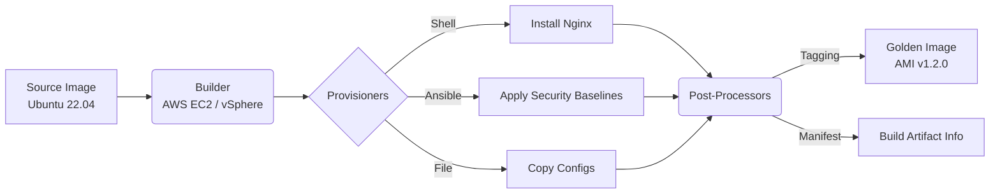

# Packer (Golden Images)

## История: Боль и Решение
**Боль:** Раньше создание образов виртуальных машин (AMI в AWS, шаблоны в VMware) было ручным, медленным и полным ошибок процессом. Инженеры запускали базовую ВМ, вручную устанавливали пакеты, настраивали конфиги и снимали "слепок". Это приводило к конфигурационному дрифту — никто точно не знал, что именно внутри образа и как его воспроизвести. 
**Решение:** [HashiCorp Packer](https://www.packer.io/) позволил описать процесс создания образов как код (Infrastructure as Code). Теперь сборка стала автоматизированной, версионируемой и идемпотентной. Вы получаете **Golden Image** — неизменяемый, проверенный и готовый к деплою образ, который одинаково собирается для AWS, Docker, Azure и локальных гипервизоров.

## Архитектура и Процесс Сборки



## Примеры конфигураций (HCL2)

Современный стандарт Packer — использование HCL (HashiCorp Configuration Language), а не старого JSON.

```hcl
# ubuntu-web.pkr.hcl

packer {
  required_plugins {
    amazon = {
      version = ">= 1.2.8"
      source  = "github.com/hashicorp/amazon"
    }
  }
}

variable "ami_prefix" {
  type    = string
  default = "golden-nginx-ubuntu"
}

source "amazon-ebs" "ubuntu" {
  ami_name      = "${var.ami_prefix}-${formatdate("YYYYMMDDhhmmss", timestamp())}"
  instance_type = "t3.micro"
  region        = "eu-central-1"
  source_ami_filter {
    filters = {
      name                = "ubuntu/images/*ubuntu-jammy-22.04-amd64-server-*"
      root-device-type    = "ebs"
      virtualization-type = "hvm"
    }
    most_recent = true
    owners      = ["099720109477"] # Canonical
  }
  ssh_username = "ubuntu"
}

build {
  name    = "web-server"
  sources = ["source.amazon-ebs.ubuntu"]

  provisioner "shell" {
    inline = [
      "sudo apt-get update",
      "sudo apt-get install -y nginx",
      "sudo systemctl enable nginx"
    ]
  }

  post-processor "manifest" {
    output     = "packer-manifest.json"
    strip_path = true
  }
}
```

## Day 2 Operations (Советы)
*   **Автоматизация через CI/CD:** Интегрируйте запуск `packer build` в пайплайны (GitLab CI, GitHub Actions). Собирайте новые образы по расписанию (например, каждую неделю) для включения свежих патчей безопасности.
*   **Управление жизненным циклом (Lifecycle Management):** Golden Images быстро накапливаются и стоят денег (хранение Snapshot'ов). Используйте инструменты вроде AWS Data Lifecycle Manager или кастомные Lambda-скрипты для удаления старых и неиспользуемых AMI.
*   **Security Scanning:** Добавьте пост-процессоры или шаги в CI для сканирования образа на уязвимости (например, Trivy) перед тем, как пометить его как готовый к проду.
*   **Специфика ОС:** Перед завершением сборки (в финальном provisioner) обязательно очищайте историю Bash, кэши пакетного менеджера (`apt-get clean`, `yum clean all`) и сбрасывайте machine-id (для Linux), чтобы избежать коллизий в сети.

## Антипаттерны
1.  **"Кухонная раковина" (Монолитные образы):** Попытка запихнуть все возможные приложения и базы данных в один Golden Image. *Правильно:* Делать специализированные образы (Web-база, DB-база) или тонкие базовые образы + Cloud-Init/Ansible для донастройки при старте.
2.  **Зашивание секретов:** Оставлять пароли, SSH-ключи или токены API внутри образа. *Правильно:* Использовать AWS Secrets Manager/HashiCorp Vault на этапе загрузки ВМ или IAM-роли.
3.  **Долгие Provisioners:** Скачивать и компилировать софт из исходников по 40 минут прямо во время сборки AMI. *Правильно:* Использовать заранее собранные бинарники или артефакты из внутреннего репозитория (Nexus/Artifactory).
