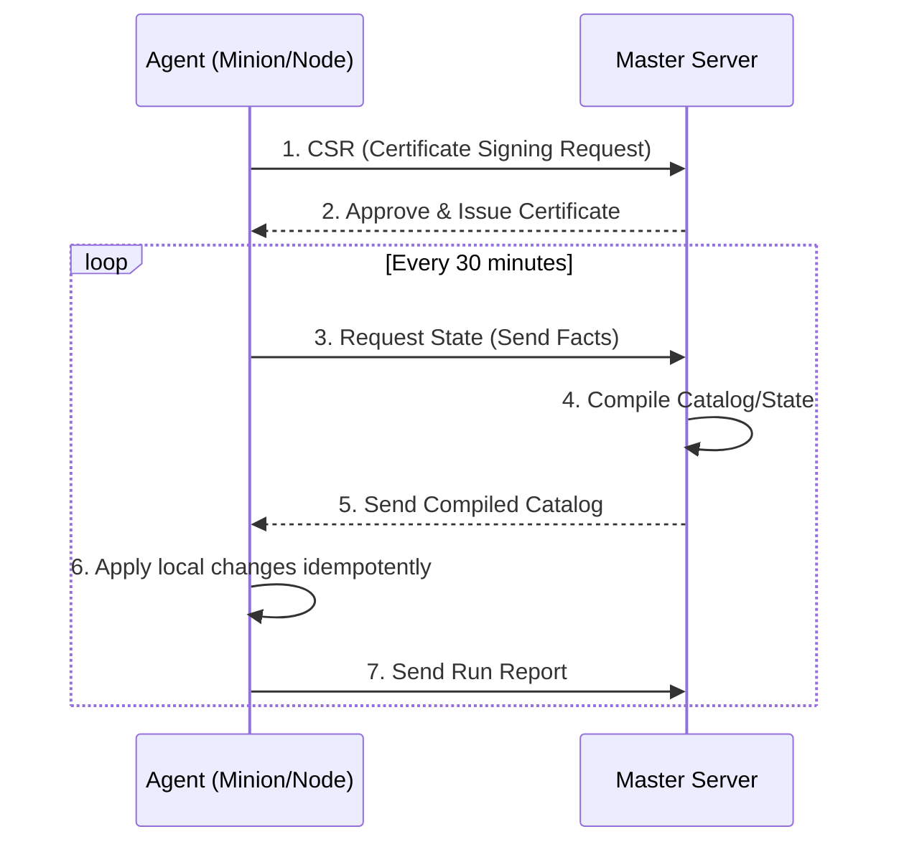

# Puppet, Chef, SaltStack (Legacy)

## История: Эра агентов и Ruby
**Боль:** Когда парк серверов вырос до тысяч машин, инструменты на базе SSH (или самописные Bash-скрипты) стали работать слишком медленно и нестабильно. Возникла потребность в масштабируемой системе, способной асинхронно управлять десятками тысяч узлов без перегрузки сети и управляющего сервера.
**Решение:** Поколение "тяжеловесных" Enterprise-систем управления конфигурациями (Puppet, Chef, SaltStack). Они популяризовали архитектуру Master-Agent и использование продвинутых DSL (Domain Specific Languages) для описания инфраструктуры.

## Архитектура
Эти инструменты обычно используют Pull-модель с локальными агентами, которые общаются с мастером по защищенному каналу:


## Примеры конфигураций

**Chef (Ruby DSL):**
Позволяет использовать всю мощь языка Ruby, но требует навыков программирования.
```ruby
package 'nginx' do
  action :install
end

service 'nginx' do
  action [:enable, :start]
end
```

**Puppet (Custom DSL):**
Строгий декларативный язык с явным указанием зависимостей.
```puppet
package { 'nginx':
  ensure => installed,
}

service { 'nginx':
  ensure => running,
  enable => true,
  require => Package['nginx'],
}
```

**SaltStack (YAML + Jinja):**
Выделяется использованием ZeroMQ для мгновенного выполнения команд и YAML/Python подходом.
```yaml
nginx_pkg:
  pkg.installed:
    - name: nginx

nginx_service:
  service.running:
    - name: nginx
    - enable: True
    - require:
      - pkg: nginx_pkg
```

## Day 2 Operations
- **Управление жизненным циклом сертификатов:** Автоматизация процессов выдачи (auto-sign) и отзыва сертификатов при масштабировании кластера.
- **Тюнинг производительности Мастера:** Компиляция манифестов (особенно в Puppet) — крайне ресурсоемкий процесс. Требуется настройка балансировщиков и пулов воркеров (например, Puppet Server JRuby instances).
- **Pruning (Очистка стейта):** Настройка автоматического удаления мертвых нод, чтобы база данных не переполнялась неактуальными фактами и отчетами.

## Антипаттерны
1. **Больше логики, чем декларативности:** Превращение конфигураций в сложные программы со множеством `if/else`, что делает код нечитаемым и сложно отлаживаемым.
2. **Использование как оркестратора:** Попытки использовать Puppet/Chef для задач, требующих строгой распределенной последовательности (например, rolling update базы данных с локами). Это задача для Terraform или специализированных деплой-тулов.
3. **Игнорирование Noop/Dry-Run режима:** Слепое применение новых манифестов без предварительной симуляции изменений, что часто приводит к массовым авариям на тысячах серверов одновременно.
