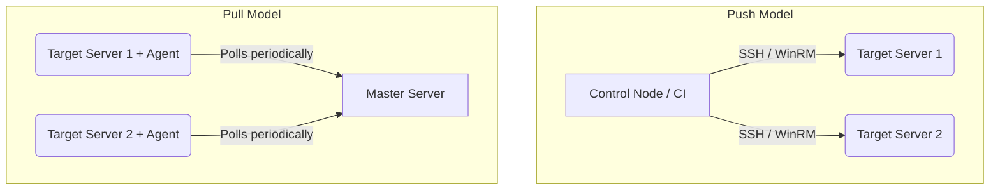

# Принципы Configuration Management

## История: От "снежинок" к конвейерам
**Боль:** Серверы настраивались вручную. Системный администратор заходил по SSH, ставил пакеты, правил конфигурационные файлы. Серверы постепенно превращались в "снежинки" (Snowflake Servers) — уникальные, хрупкие и невоспроизводимые. При падении такого сервера на его восстановление уходили дни, так как никто не помнил точную последовательность команд.
**Решение:** Configuration Management (CM). Практика описания желаемого состояния системы в виде кода (Configuration as Code) и автоматического приведения серверов к этому состоянию с помощью идемпотентных инструментов. 

## Архитектура и модели
Существует два основных подхода к доставке и применению конфигураций:


## Императивный vs Декларативный подход
Главное правило CM: описывать *что* мы хотим получить (декларативно), а не *как* это сделать (императивно).

**Антипаттерн (Императивный Bash):**
```bash
if ! grep -q "nginx" /etc/passwd; then
  apt-get update && apt-get install -y nginx
  systemctl start nginx
fi
```

**Паттерн (Декларативный YAML - Ansible-подобный):**
```yaml
- name: Ensure Nginx is installed and running
  package:
    name: nginx
    state: present
  service:
    name: nginx
    state: started
    enabled: true
```

## Day 2 Operations
- **Drift Management:** Регулярный запуск конфигураций в режиме dry-run для выявления отклонений (drift) реального состояния серверов от описанного в Git.
- **Testing:** Использование инструментов (Molecule, Test Kitchen) для запуска и проверки плейбуков/манифестов на эфемерных ВМ перед слиянием кода.
- **Continuous Integration:** Синтаксический анализ (linting) и проверки безопасности на каждый Pull Request.

## Антипаттерны
1. **Ручные изменения (Band-aids):** Внесение быстрых правок прямо на сервере в обход CM. При следующем запуске CM эти изменения будут затерты.
2. **Секреты в открытом виде:** Хранение паролей и токенов прямо в манифестах (всегда используйте решения вроде Vault, SOPS, Ansible Vault).
3. **Отсутствие идемпотентности:** Написание кастомных команд, повторный запуск которых ломает систему (например, `command: mkdir /app` без проверки существования директории).
