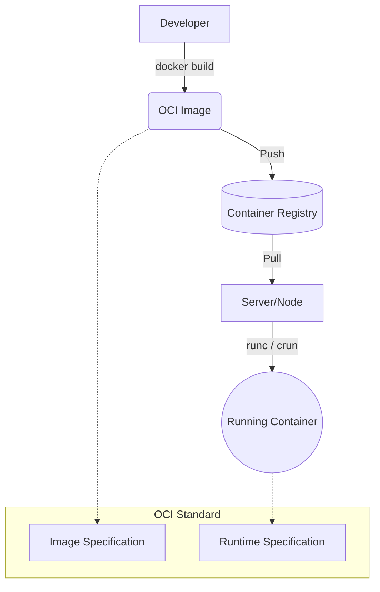

# 00 Основы контейнеризации и OCI (Open Container Initiative)

## 📖 История: Боль и Решение
**Боль:** Раньше мы выкатывали приложения на виртуальные машины. "У меня на локалке всё работает" — классическая отмазка разработчиков. Различия в версиях библиотек, ОС и зависимостях приводили к "аду зависимостей". Развёртывание нового сервера занимало дни или недели.
**Решение:** Контейнеры. Упаковка приложения со всеми зависимостями в единый артефакт. OCI (Open Container Initiative) стандартизировал форматы образов (Image Spec) и среду выполнения (Runtime Spec), чтобы мы не зависели от одного вендора (например, Docker) и могли запускать контейнеры где угодно одинаково.

## 🏗 Архитектура и Mermaid-схема



## 💻 Примеры (Docker/bash)

Создание простого OCI-совместимого образа:
```dockerfile
# Dockerfile
FROM alpine:3.18
RUN apk add --no-cache curl
CMD ["curl", "https://example.com"]
```

```bash
# Сборка образа
docker build -t my-curl-app:v1 .

# Экспорт образа в OCI формат (через skopeo или docker save)
docker save my-curl-app:v1 -o my-curl-app.tar

# Запуск
docker run --rm my-curl-app:v1
```

## 🛠 Day 2 Operations (Советы)
- **Используйте легковесные базовые образы:** `alpine`, `distroless` или `scratch`. Это уменьшает attack surface (поверхность атаки) и ускоряет скачивание.
- **Сканирование образов:** Интегрируйте Trivy или Clair в ваш CI/CD пайплайн для поиска уязвимостей в зависимостях ОС до деплоя.
- **Неизменяемая инфраструктура:** Никогда не обновляйте пакеты внутри запущенного контейнера (никаких `apt-get update` по SSH в контейнер). Пересобирайте образ и деплойте новую версию.

## 🚫 Антипаттерны
- **Монолитный контейнер (Fat Container):** Запуск нескольких процессов (nginx, php-fpm, cron) внутри одного контейнера через systemd/supervisord. *Контейнер = один логический процесс.*
- **Хранение стейта в контейнере:** Использование локальной файловой системы контейнера для базы данных или загруженных файлов. При пересоздании контейнера данные исчезнут. *Используйте Volumes (PVC в Kubernetes).*
- **Запуск от root:** Использование пользователя root внутри контейнера. При пробитии изоляции атакующий получит root на хосте. *Всегда используйте директиву `USER` в Dockerfile.*
