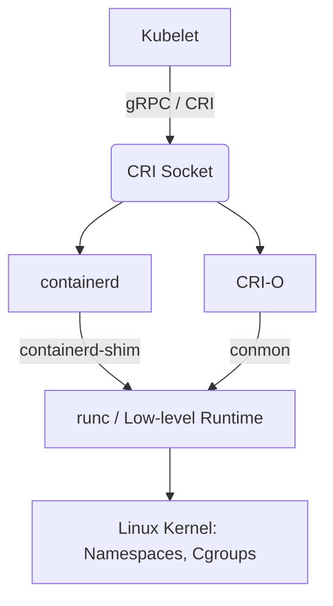

# Container Runtime (containerd, CRI-O)

## 📖 История: Боль и Решение
**Боль:** В начале эры Kubernetes Docker был единственным способом запускать контейнеры. Но Docker — это огромный монолит, включающий CLI, API, сборщик образов (buildkit) и среду выполнения. Kubelet приходилось общаться с Docker через "костыль" (dockershim), что усложняло архитектуру и приводило к лишним накладным расходам и багам.
**Решение:** Появление CRI (Container Runtime Interface) в Kubernetes и выделение среды выполнения в отдельные, легковесные компоненты. Появились High-level runtimes (containerd, CRI-O), которые умеют только то, что нужно K8s: скачивать образы и управлять жизненным циклом контейнеров, делегируя сам запуск Low-level runtimes (runc). Dockershim был удален!

## 🏗 Архитектура и Mermaid-схема



## 💻 Примеры (bash/crictl)

Поскольку Docker CLI не общается напрямую с CRI, для дебага в среде Kubernetes используется `crictl`:

```bash
# Настройка crictl для работы с containerd
cat <<EOF | sudo tee /etc/crictl.yaml
runtime-endpoint: unix:///run/containerd/containerd.sock
image-endpoint: unix:///run/containerd/containerd.sock
EOF

# Просмотр запущенных подов (аналог docker ps)
crictl pods

# Просмотр образов на ноде (аналог docker images)
crictl images

# Просмотр логов контейнера (аналог docker logs)
crictl logs <container-id>
```

Для прямого взаимодействия с containerd без CRI можно использовать `ctr` (поставляется с containerd) или `nerdctl` (Docker-совместимый CLI).

## 🛠 Day 2 Operations (Советы)
- **Тюнинг containerd:** Настраивайте `config.toml` для garbage collection (очистки неиспользуемых образов), настройки зеркал registry (registry mirrors) и лимитов параллельного скачивания образов.
- **crictl вместо docker:** Приучите команду использовать `crictl` для траблшутинга на нодах Kubernetes. Команды `docker` там больше не работают (если вы используете современные версии K8s).
- **Разделение Low-level runtimes:** Рассмотрите использование разных runtime-классов (RuntimeClasses) в K8s. Например, используйте `runc` для обычных приложений и `gVisor` (`runsc`) или `Kata Containers` для untrusted (недоверенного) кода, требующего жесткой изоляции от ядра хоста.

## 🚫 Антипаттерны
- **Установка Docker на Worker-ноды K8s:** С версии Kubernetes 1.24+ Docker больше не поддерживается "из коробки" как runtime. Установка Docker Engine только расходует ресурсы. *Используйте containerd (по умолчанию в большинстве дистрибутивов) или CRI-O.*
- **Завязка на docker socket:** Монтирование `/var/run/docker.sock` в CI/CD поды (например, для Jenkins или GitLab CI) для сборки образов. Это огромная дыра в безопасности и это перестанет работать при переходе на containerd. *Используйте daemonless сборщики: Kaniko, Buildah или корневой/rootless Buildkit.*
- **Ручное удаление образов на нодах:** Попытки руками чистить диск ноды через `crictl rmi`. *Позвольте Kubelet'у (ImageGC) автоматически управлять очисткой места.*
