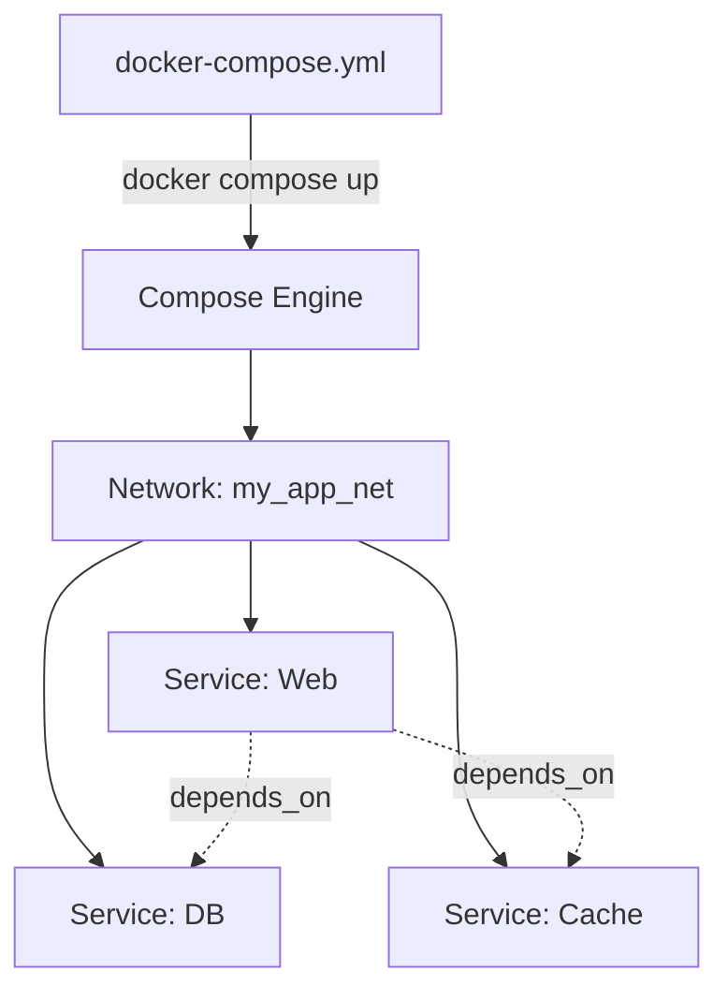

# Docker Compose

## 📖 История: Боль и Решение
**Боль:** Запускать многокомпонентное приложение (например, веб-сервер, базу данных, кеш) через `docker run` — это ад. Длинные скрипты с кучей флагов для портов, переменных окружения и сетей, которые сложно поддерживать, читать и легко сломать.
**Решение:** Инструмент для декларативного описания многоконтейнерных приложений в одном `YAML` файле. Вы определяете инфраструктуру как код, и одной командой поднимаете весь стек в единой, связанной сети.

## 🏗 Архитектура



## 💻 Примеры

**Пример docker-compose.yml:**
```yaml
version: '3.8'
services:
  web:
    image: nginx:1.25-alpine
    ports:
      - "8080:80"
    depends_on:
      - app
    networks:
      - frontend

  app:
    image: myapp:v1.2.0
    environment:
      - DB_HOST=db
      - DB_USER=${DB_USER}
      - DB_PASS=${DB_PASS}
    networks:
      - frontend
      - backend

  db:
    image: postgres:15-alpine
    volumes:
      - pgdata:/var/lib/postgresql/data
    networks:
      - backend

networks:
  frontend:
  backend:

volumes:
  pgdata:
```

**Базовые команды (Bash):**
```bash
# Запуск в фоне
docker compose up -d

# Остановка и удаление контейнеров, сетей
docker compose down

# Просмотр логов всех сервисов
docker compose logs -f

# Пересборка образов при запуске
docker compose up -d --build
```

## 🛠 Day 2 Operations (Советы по эксплуатации)
- **Управление секретами:** Используйте файл `.env` рядом с `docker-compose.yml` для передачи секретов через интерполяцию `${VAR}`. Никогда не коммитьте `.env` в Git.
- **Масштабирование:** Для горизонтального масштабирования сервиса (без жестко заданных портов на хосте) используйте `docker compose up -d --scale web=3`.
- **Profiles (Профили):** Используйте профили, чтобы выборочно запускать части стека (например, поднимать моки только для локальной разработки: `profiles: ["dev"]`).
- **Restart Policies:** Всегда указывайте `restart: unless-stopped` для критичных сервисов, чтобы они автоматически поднимались после перезагрузки демона или хоста.

## ☠️ Антипаттерны
- **Всё в одном файле:** Создание гигантского compose-файла на тысячи строк для десятков не связанных друг с другом проектов (микросервисов). Разбивайте по логическим доменам.
- **Использование тега `:latest`:** Ведет к непредсказуемым обновлениям и поломке приложения при пересоздании контейнеров (non-deterministic builds).
- **Забытые Volumes:** Запуск БД в compose без объявления именованного volume — при выполнении `docker compose down` вы потеряете все данные.
- **Слепая вера в `depends_on`:** Зависимость по старту контейнера не гарантирует, что сервис (например, СУБД) готов принимать подключения. Приложение должно уметь делать ретраи (retry) при подключении, либо нужно использовать `condition: service_healthy`.
