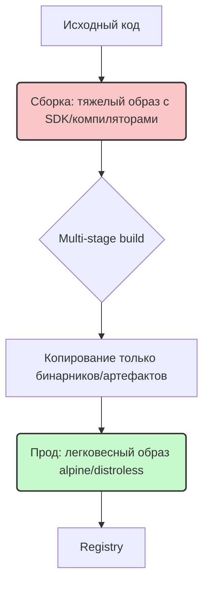

# Dockerfile: Instructions и Best Practices

## История: Боль и Решение
**Боль:** Разработчик написал микросервис, который локально работает отлично. Он отправляет код в прод, и там всё падает, потому что версия Node.js отличается, нет нужных библиотек ОС, а образ весит 2 ГБ, содержит кучу уязвимостей и собирается полчаса.
**Решение:** Написать оптимальный `Dockerfile` с использованием многоэтапной сборки (multi-stage build), зафиксированных версий базовых образов и правильного кэширования слоев. Это дает легковесные, безопасные и абсолютно воспроизводимые артефакты везде.

## Mermaid-схема: Оптимизация сборки и слоев



## Основные инструкции
- `FROM`: Базовый образ (всегда указывайте тег, избегайте `latest`).
- `WORKDIR`: Рабочая директория (предпочтительнее вместо `RUN cd ...`).
- `COPY`: Копирование файлов/папок из контекста в образ.
- `RUN`: Выполнение команд при сборке (установка пакетов).
- `CMD` / `ENTRYPOINT`: Команда по умолчанию при запуске контейнера.

### Пример хорошего Dockerfile (Node.js)
```dockerfile
# Stage 1: Build
FROM node:20.10.0-alpine3.18 AS builder
WORKDIR /app
# Кэшируем зависимости
COPY package*.json ./
RUN npm ci
# Копируем остальной код
COPY . .
RUN npm run build

# Stage 2: Production
FROM node:20.10.0-alpine3.18
WORKDIR /app
COPY --from=builder /app/package*.json ./
RUN npm ci --only=production
COPY --from=builder /app/dist ./dist
# Безопасность: не работаем под root
USER node
CMD ["node", "dist/index.js"]
```

## Best Practices & Day 2 Operations
- **Используйте Multi-stage builds:** Уменьшает размер образа и attack surface (потенциальные CVE).
- **Сортируйте инструкции для кэша:** Сначала копируйте файлы зависимостей (`package.json`, `go.mod`), устанавливайте их, а затем копируйте исходный код. Это спасет кэш при частом изменении кода.
- **Минимизируйте количество слоев:** Объединяйте команды `RUN` через `&&`. В том же слое удаляйте кэш пакетного менеджера (например, `RUN apt-get update && apt-get install -y ... && rm -rf /var/lib/apt/lists/*`).
- **Запускайте от non-root пользователя:** Всегда создавайте пользователя или используйте встроенного (как `USER node`).
- **Day 2 Ops - Мониторинг образов:** 
  - Регулярно сканируйте образы в Registry (например, Trivy, Clair).
  - Настройте автоматическую пересборку пайплайнов при выходе патчей безопасности базового образа.
  - Используйте тэгирование по коммитам (Git SHA), а не просто `v1.0.1`, чтобы легко связывать образ в проде с кодом.

## Антипаттерны
- **Использование `latest` тега:** `FROM ubuntu:latest` — при следующей сборке может прилететь мажорное обновление и сломать приложение.
- **Секреты в Dockerfile:** `ENV API_KEY=12345` или `COPY .env`. Используйте Docker Secrets, BuildKit `--secret` или внешние Vault.
- **Монолит в контейнере:** Использование `supervisord` или `systemd` для запуска БД, кэша и приложения в одном контейнере — это антипаттерн (нарушает принцип "один процесс на контейнер", затрудняет масштабирование и сбор логов).
- **Слепое использование `COPY . .`:** Обязательно используйте `.dockerignore`, чтобы не тащить `node_modules`, `.git` и локальные конфиги/секреты в контекст сборки.
