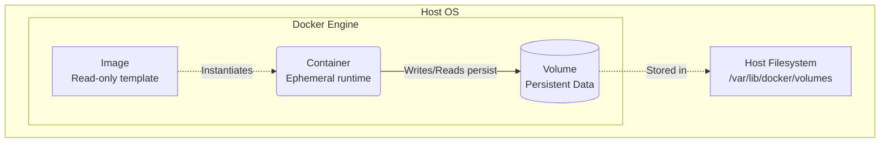

# Docker: Images, Containers, Volumes

## 📖 DevOps Story: Боль и Решение
**Боль:** Приложение упало из-за нехватки памяти (OOM), контейнер перезапустился, но база данных и все загруженные пользователями файлы исчезли! Вдобавок образ весит 2.5 ГБ, скачивается целую вечность и содержит компиляторы и исходники.
**Решение:** Разделение сущностей. Образ — это неизменяемый (immutable) слепок приложения (минимально возможного размера). Контейнер — эфемерная среда выполнения. Volumes (тома) — место для персистентного хранения данных, не зависящее от жизненного цикла контейнера.

## 🏗 Архитектура / Mermaid


## 💻 Примеры (Docker/Bash)

### Создание минимального образа (Multi-stage build)
```dockerfile
# Сборка
FROM golang:1.20 AS builder
WORKDIR /app
COPY . .
RUN CGO_ENABLED=0 go build -o myapp .

# Финальный легковесный образ
FROM alpine:3.18
WORKDIR /app
COPY --from=builder /app/myapp .
CMD ["./myapp"]
```

### Запуск с привязкой Volume
```bash
# Создание именованного volume
docker volume create app_data

# Запуск контейнера с подключением тома
docker run -d \
  --name my-database \
  -v app_data:/var/lib/postgresql/data \
  postgres:15-alpine
```

## 🛠 Day 2 Operations
- **Бэкап Volumes:** Тома не бэкапятся сами по себе. Настройте скрипты или используйте плагины для регулярного резервного копирования критичных volume'ов.
- **Мониторинг места:** Следите за размером `dangling` (осиротевших) образов и volume'ов, которые больше не используются никакими контейнерами.
- **Очистка ресурсов:**
  ```bash
  # Удаление остановленных контейнеров, неиспользуемых сетей и dangling образов
  docker system prune -a --volumes
  ```

## ⚠️ Антипаттерны
- **Хранение стейта в контейнере:** Запись файлов логов, базы данных или сессий прямо в файловую систему контейнера (всё пропадет при перезапуске).
- **Монтирование через Bind Mounts (host path) для баз данных в проде:** Лучше использовать Docker Volumes, так как Docker управляет их правами и жизненным циклом эффективнее.
- **"Толстые" образы:** Включение в финальный образ инструментов для сборки, тестовых данных или секретов.
