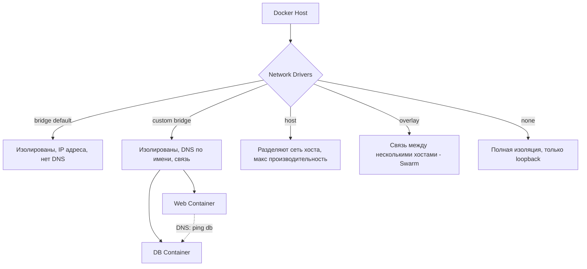

# Docker Networks: Связность и изоляция

## 💥 История боли и решения
**Боль:** Два контейнера (Web и DB) запущены, но Web не видит DB. Разработчик хардкодит IP-адреса, но после рестарта DB получает новый IP, и всё ломается. Вдобавок база данных случайно проброшена портом наружу (0.0.0.0:5432).
**Решение:** Использование пользовательских Bridge-сетей (Custom Bridge Network) со встроенным DNS-разрешением имен и правильный проброс портов.

## 📊 Архитектура сетевых драйверов (Mermaid)



## 🛠️ Практические примеры (Bash/Docker)

### 1. Создание сети и связь по имени
```bash
# Создаем свою сеть
docker network create my-app-net

# Запускаем БД в сети
docker run -d --name postgres-db --network my-app-net postgres:15

# Запускаем приложение и стучимся к БД по ИМЕНИ КОНТЕЙНЕРА
docker run --rm -it --network my-app-net alpine sh -c "ping postgres-db"
```

### 2. Изоляция и безопасность
```bash
# Запрещаем внешнюю связь (internal)
docker network create --internal secure-net

# БД в изолированной сети
docker run -d --name secret-db --network secure-net redis

# Web-сервер в двух сетях (frontend и secure-net)
docker run -d --name backend --network frontend-net --network secure-net my-backend
```

### 3. Траблшутинг сети
```bash
# Посмотреть, какие контейнеры подключены к сети и их IP
docker network inspect my-app-net

# Посмотреть проброшенные порты
docker port <container_name>
```

## 🌅 Day 2 Operations (Советы)
1. **Явные порты:** При биндинге портов всегда указывайте интерфейс хоста, если не хотите торчать в интернет: `-p 127.0.0.1:5432:5432` вместо `-p 5432:5432`.
2. **Избегайте конфликтов подсетей:** Если Docker-сеть (например, 172.17.x.x) пересекается с вашей корпоративной сетью, измените `bip` (Bridge IP) в `/etc/docker/daemon.json`.
3. **Используйте Docker Compose:** Управление сетями вручную утомительно. Docker Compose автоматически создает кастомную сеть для стека сервисов.

## ☠️ Антипаттерны
- **Использование default bridge сети (`docker0`)** - Контейнеры в default bridge могут общаться только по IP-адресам (нет автоматического DNS-разрешения).
- **Использование `--network host` без причины** - Ломает изоляцию, может вызвать конфликты портов на хосте и снижает безопасность.
- **Проброс портов для межконтейнерного взаимодействия** - Если Web общается с DB на одном хосте, пробрасывать порты через `-p` наружу НЕ нужно. Они прекрасно свяжутся по внутренней сети Docker.
