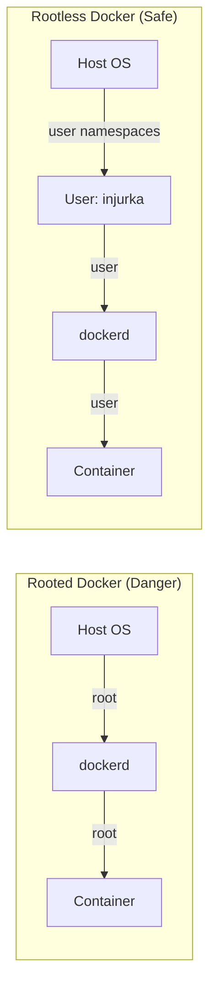

# Docker Security и Rootless

## 📖 История: Боль и Решение
**Боль:** По умолчанию демон Docker (`dockerd`) и процессы внутри контейнеров работают от имени суперпользователя `root`. Если злоумышленник найдет уязвимость в приложении внутри контейнера (container breakout), он потенциально может получить права root на самой хост-машине.
**Решение:** Применение принципа наименьших привилегий — Rootless режим (запуск демона и контейнеров от обычного пользователя) и использование профилей безопасности (Seccomp, AppArmor, Capabilities), чтобы максимально зажать контейнер в песочнице.

## 🏗 Архитектура Rootless



## 💻 Примеры

**Установка Rootless режима:**
```bash
# Установка и запуск скрипта настройки rootless режима
dockerd-rootless-setuptool.sh install

# Настройка переменных окружения (добавить в ~/.bashrc или ~/.zshrc)
export DOCKER_HOST=unix:///run/user/$(id -u)/docker.sock
```

**Безопасный запуск контейнера (Харденинг без Rootless):**
```bash
docker run -d \
  --name secure_app \
  --read-only \
  --tmpfs /tmp \
  --cap-drop=ALL \
  --security-opt=no-new-privileges:true \
  --user 1000:1000 \
  my-app:v1.0
```
*Что тут происходит:*
1. `--read-only` — Корневая файловая система контейнера доступна только для чтения (защита от внедрения малвари и шеллов).
2. `--tmpfs /tmp` — Монтируем оперативную память для временных файлов, так как основная ФС read-only.
3. `--cap-drop=ALL` — Сброс всех Linux capabilities (прав суперпользователя на уровне ядра).
4. `--security-opt=no-new-privileges:true` — Запрет процессам получать новые права (например, через `suid` биты).
5. `--user 1000:1000` — Запуск приложения от непривилегированного пользователя внутри контейнера.

## 🛠 Day 2 Operations (Советы по эксплуатации)
- **Vulnerability Scanning:** Интегрируйте сканирование образов (например, `trivy image my-app:v1.0`) в CI/CD пайплайн. Не деплойте уязвимые образы.
- **Минимальные базовые образы:** Используйте `alpine`, `distroless` или `scratch`. Чем меньше системных утилит в образе (отсутствуют shell, curl, wget), тем меньше поверхность атаки (attack surface).
- **Подпись образов:** Используйте Cosign или Docker Content Trust (Notary), чтобы гарантировать, что вы запускаете ровно тот образ, который собрали, и его не подменили в Registry.
- **Runtime Мониторинг:** Используйте Falco или Tetragon для мониторинга подозрительного поведения внутри контейнеров (например, неожиданный запуск шелла или открытие системных файлов в `/etc`).

## ☠️ Антипаттерны
- **Проброс сокета (Socket Mount):** Монтирование `-v /var/run/docker.sock:/var/run/docker.sock` внутрь контейнера. Это дает контейнеру полный контроль над демоном Docker, что равносильно root-доступу к хосту.
- **Привилегированный режим:** Использование флага `--privileged`. Отключает всю изоляцию (cgroups, namespaces, seccomp), давая процессу прямой доступ к устройствам хост-системы.
- **Работа из-под root внутри контейнера:** Оставление `USER root` по умолчанию в Dockerfile. Всегда создавайте отдельного пользователя (`RUN adduser ... && USER appuser`).
- **Хранение секретов в Image:** Передача секретов через инструкции `ENV` или запекание их прямо в файлы образа (такие секреты легко извлекаются через `docker inspect` или анализ слоев). Используйте Docker Secrets или внешние Vault-решения.
