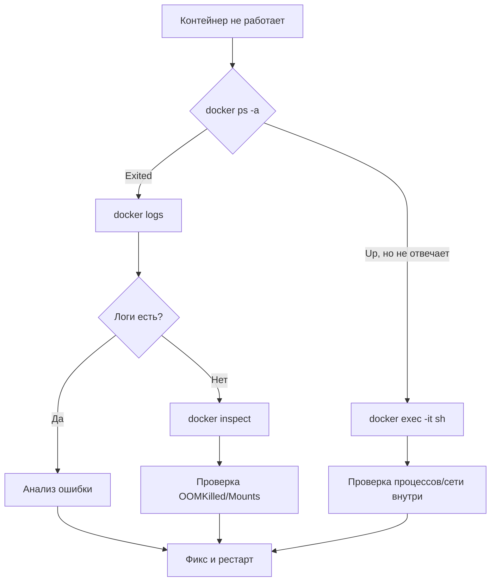

# Docker Troubleshooting: Искусство дебага

## 💥 История боли и решения
**Боль:** Пятница вечер. Прод "лежит". Контейнер с базой данных циклично рестартует (CrashLoopBackOff в душе, `Restarting (1)` в `docker ps`). Логи пустые. Место на диске заканчивается.
**Решение:** Отказ от слепого перезапуска и переход к системному траблшутингу: анализ логов, инспекция состояния, запуск sidecar-контейнеров для отладки.

## 📊 Алгоритм траблшутинга (Mermaid)



## 🛠️ Практические примеры (Bash/Docker)

### 1. Поиск причины падения
```bash
# Смотрим статус завершения и OOM (Out Of Memory)
docker inspect <container_name> --format='{{.State.ExitCode}} - OOM: {{.State.OOMKilled}}'

# Смотрим последние логи с таймстемпами
docker logs --tail 100 --timestamps <container_name>
```

### 2. Отладка сети и зависимостей (когда нет curl/ping внутри)
```bash
# Подключаемся к network namespace проблемного контейнера
docker run -it --rm --network container:<broken_container> nicolaka/netshoot

# Проверяем порты внутри
netstat -tulpn
```

### 3. Чистка мусора (когда "No space left on device")
```bash
# Показывает, что именно съело место
docker system df

# Осторожно! Удаляет остановленные контейнеры, неиспользуемые сети и dangling образы
docker system prune -a --volumes
```

## 🌅 Day 2 Operations (Советы)
1. **Настройте ротацию логов!** По умолчанию Docker пишет логи в JSON файлах без ограничений, что убивает диск. В `daemon.json`:
   ```json
   {
     "log-driver": "json-file",
     "log-opts": {"max-size": "50m", "max-file": "3"}
   }
   ```
2. **Мониторинг Docker Daemon:** Интегрируйте `docker stats` в Prometheus (например, через cAdvisor), чтобы видеть тренды потребления CPU/RAM.
3. **Используйте Healthchecks:** Контейнер может быть `Up`, но сервис внутри висит. `HEALTHCHECK` позволяет Docker'у перезапускать залипшие сервисы.

## ☠️ Антипаттерны
- **Вход в контейнер для изменения файлов (`docker exec vi config.json`)** - Контейнеры эфемерны! При рестарте изменения пропадут. Решение: менять конфигурацию через Volumes или ConfigMap.
- **Игнорирование Exit Codes** - Код `137` (SIGKILL) часто значит OOMKilled, а `143` (SIGTERM) - graceful shutdown. Знание кодов экономит часы отладки.
- **Запуск с `--privileged` для решения проблем с правами** - Открывает огромную дыру в безопасности. Используйте точечные capabilities (`--cap-add`).
