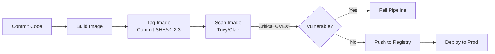

# Image Tagging и Scanning

## 📖 DevOps Story: Боль и Решение
**Боль:** Команда выкатила в продакшен образ с тегом `:latest`. Внезапно все упало, потому что базовая библиотека обновилась с ломающими изменениями. Через неделю безопасники прибежали с отчетом: в образе, который крутится в проде уже месяц, нашли критическую уязвимость (CVE).
**Решение:** Отказ от мутабельных тегов (внедрение семантического версионирования или Git SHA) и автоматическое сканирование образов на уязвимости еще на этапе CI-пайплайна.

## 🏗 Архитектура / Mermaid


## 💻 Примеры (Docker/Bash)

### Tagging (Правильный подход)
```bash
# Тегирование с использованием Git SHA
COMMIT_SHA=$(git rev-parse --short HEAD)
docker build -t myapp:${COMMIT_SHA} -t myapp:v1.2.3 .

# Пуш конкретных тегов
docker push myapp:${COMMIT_SHA}
docker push myapp:v1.2.3
```

### Scanning (Использование Trivy)
```bash
# Локальное сканирование перед пушем
trivy image myapp:v1.2.3

# Сканирование в CI с фейлом при критических уязвимостях
trivy image --severity CRITICAL --exit-code 1 myapp:v1.2.3
```

## 🛠 Day 2 Operations
- **Автоматизация:** Настройте периодическое сканирование образов прямо в вашем Container Registry (например, Harbor, AWS ECR, GitLab CR), так как новые уязвимости (CVE) появляются каждый день, даже если образ не менялся.
- **Очистка (Garbage Collection):** Настройте политики удаления старых образов (retention policies) в registry, чтобы не переполнять хранилище мусорными тегами.
- **Подписи образов (Image Signing):** Используйте инструменты вроде Cosign или Notary для подписи образов, чтобы в прод попадали только верифицированные артефакты.

## ⚠️ Антипаттерны
- **Использование тега `:latest` в production:** Никогда не знаешь, какая именно версия кода сейчас запущена. Откат (rollback) становится невозможным или непредсказуемым.
- **Игнорирование отчетов сканеров:** Сканирование ради галочки, когда пайплайн не падает при нахождении критических уязвимостей.
- **Тегирование только версиями:** Отсутствие связи между образом и конкретным коммитом (отсутствие Git SHA тега) усложняет дебаг.
