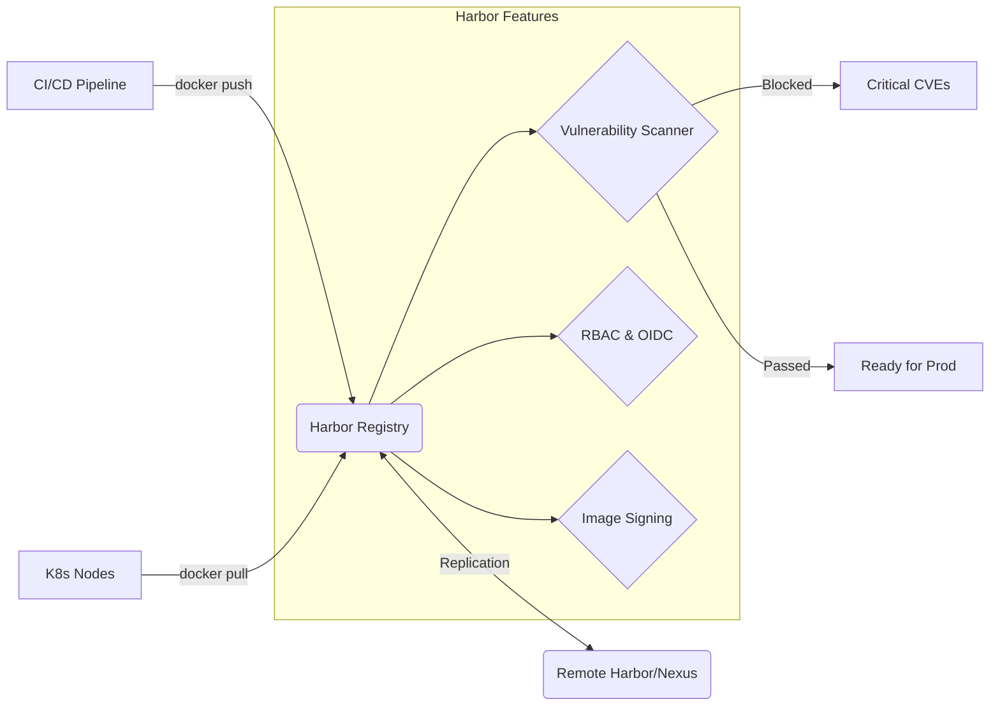

# Container Registry (Docker Hub, Harbor, Nexus, Artifactory)

## DevOps История
**Боль:** Команды используют публичный Docker Hub для хранения корпоративных образов или разворачивают простой registry, но сталкиваются с проблемами безопасности (уязвимости в образах), отсутствием управления доступом (RBAC), медленным скачиванием в распределенных дата-центрах и невозможностью хранить другие типы артефактов (Helm charts, NPM).
**Решение:** Enterprise-ready Container Registry (Harbor, Nexus, Artifactory). Они предоставляют сканирование на уязвимости (Trivy/Clair), репликацию между регионами, строгий RBAC, подписывание образов (Cosign/Notary) и кэширование (proxy cache) для публичных реестров.

## Архитектура



## Примеры (Bash/Docker)

**Настройка Pull Through Cache в Docker:**
Если Harbor настроен как прокси-кэш для Docker Hub, обновите `/etc/docker/daemon.json` на нодах:
```json
{
  "registry-mirrors": ["https://harbor.company.internal/v2/dockerhub-proxy"]
}
```

**Авторизация и работа с Harbor:**
```bash
# Логин в приватный registry
docker login harbor.company.internal -u robot-ci -p $ROBOT_TOKEN

# Тегирование и пуш
docker tag myapp:v1.0 harbor.company.internal/backend/myapp:v1.0
docker push harbor.company.internal/backend/myapp:v1.0
```

## Day 2 Operations
- **Garbage Collection (GC):** Регулярно запускайте GC и настройте Retention Policies (например, "хранить 10 последних сборок, удалять нетегированные"). Иначе хранилище (S3/Disk) быстро переполнится.
- **Интеграция с OIDC/AD:** Настройте SSO, чтобы разработчики заходили в веб-интерфейс Registry со своими корпоративными учетками и автоматически получали нужные права по группам.
- **Сканирование (Trivy):** Настройте ежедневное сканирование образов и запретите pull для образов с критическими уязвимостями, для которых есть фиксы.
- **Резервное копирование:** Бэкапьте базу данных Registry (Postgres) и ключи шифрования. Сами слои (хранилище S3) обычно имеют встроенную отказоустойчивость.

## Антипаттерны
- ❌ **Использование тега `latest` в проде:** `latest` мутирует, из-за чего невозможно гарантировать, что в проде работает тот же код, что тестировался. Используйте Git SHA или семантические версии.
- ❌ **Хранение секретов в образе:** Хардкод паролей при сборке — Registry не спасет от их утечки, если образ кто-то скачает.
- ❌ **Отсутствие квотирования:** Без лимитов на объем проектов (namespaces) один сервис может занять всё доступное место в Registry.
