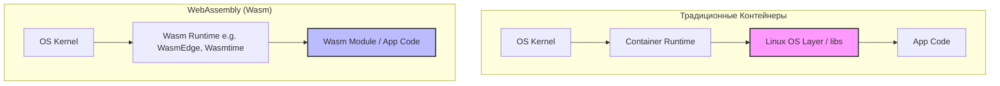

# WebAssembly (Wasm) в облаке

## DevOps-история: Боль и Решение
**Боль:** Контейнеры (Docker) отличные, но они все еще несут в себе легковесную ОС (даже Alpine или scratch). Холодный старт может занимать секунды, а образы весят мегабайты. Для edge-вычислений, бессерверных функций и IoT это слишком медленно и тяжело. Кроме того, контейнеры привязаны к архитектуре хоста (x86, ARM).

**Решение:** WebAssembly (Wasm) — бинарный формат инструкций, изначально созданный для браузеров. Wasm модули запускаются в песочнице с изоляцией на уровне памяти. Они стартуют за микросекунды, весят килобайты, абсолютно кроссплатформенны и безопасны (строгий контроль доступа через WASI). Wasm не заменяет Docker, а дополняет его для супер-легких воркфлоу, расширяя границы cloud-native.

## Архитектура


## Примеры

Сборка и запуск Wasm-приложения с использованием современного Docker (который теперь поддерживает Wasm благодаря containerd image store):
```bash
# Запуск wasm образа, скомпилированного под wasi
docker run -dp 8080:8080 \
  --name wasm-example \
  --runtime=io.containerd.wasmedge.v1 \
  --platform=wasi/wasm \
  secondstate/rust-example-hello
```

Или с использованием Spin (микрофреймворк для Wasm от Fermyon):
```bash
# Создание нового проекта Wasm
spin new http-rust hello-wasm
cd hello-wasm
# Сборка и локальный запуск (запускается за микросекунды)
spin build
spin up
```

## Day 2 Operations (Советы)
- **Интеграция с Kubernetes:** Kubernetes поддерживает Wasm через `RuntimeClass`. Вы можете запускать Wasm модули в подах Kubernetes наряду с обычными контейнерами (через `runwasi` и `containerd` шимы).
- **Мониторинг и Observability:** Wasm модули живут очень недолго (эфемерны). Инструментируйте исходный код (например, Rust, Go, Python) с использованием OpenTelemetry SDK *до* компиляции в Wasm, чтобы трейсы улетали в ваш коллектор.
- **Управление зависимостями и безопасность:** Регулярно обновляйте ваши Wasm-рантаймы (Wasmtime, WasmEdge, Spin) для защиты от уязвимостей движка. Пользуйтесь `dependabot` или `renovate` для отслеживания версий рантаймов.

## Антипаттерны
- **Пытаться перенести легаси-монолит в Wasm:** Wasm идеален для чистых функций, микросервисов и плагинов. Тяжелые легаси-приложения с кучей системных зависимостей (например, сложные Java-монолиты или приложения, глубоко завязанные на файловую систему) лучше оставить в Docker.
- **Игнорировать ограничения WASI:** WASI (WebAssembly System Interface) все еще развивается (WASI Preview 2, компоненты). Доступ к сети (особенно исходящие TCP/UDP), файловой системе и сокетам строго ограничен песочницей. Не ожидайте, что любой код, скомпилированный в Wasm, сходу сможет сделать SQL-запрос к базе данных без настройки capability.
