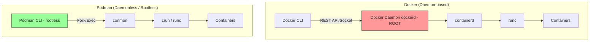

# Альтернативы (Podman, Buildah, Nerdctl)

## DevOps-история: Боль и Решение
**Боль:** Классический Docker работает через центральный фоновый процесс — `dockerd`. По умолчанию этот демон требует root-прав, что создает огромную дыру в безопасности (root escalation). Если демон падает, падают и все запущенные им контейнеры. Кроме того, запускать Docker внутри CI/CD-пайплайнов (например, внутри подов Kubernetes) через Docker-in-Docker (DinD) — это сложно, требует привилегированных контейнеров и небезопасно.

**Решение:** Переход на Daemonless и Rootless инструменты, которые полностью совместимы со стандартами OCI (Open Container Initiative). 
- **Podman:** Полноценная замена `docker run`, работает без центрального демона, rootless из коробки (контейнеры запускаются от имени пользователя).
- **Buildah:** Утилита, сфокусированная исключительно на сборке образов (`docker build`), идеальна для интеграции в shell-скрипты и CI/CD-пайплайны.
- **Nerdctl:** Замена `docker` CLI, созданная специально для прямого управления `containerd` (используется в современном K8s).

## Архитектура: Docker vs Podman (Daemonless)


## Примеры

**Podman (запуск и создание подов):**
```bash
# Алиас для безболезненного перехода
alias docker=podman

# Запуск контейнера без root (используется user namespaces)
podman run -d -p 8080:80 nginx

# Фишка Podman: создание "подов" (групп контейнеров), концепция как в Kubernetes
podman pod create --name frontend-pod -p 8080:80
podman run -d --pod frontend-pod --name web nginx
podman run -d --pod frontend-pod --name sidecar fluentd
```

**Buildah (сборка без демона для CI/CD):**
```bash
# Сборка образа прямо в bash-скрипте, шаг за шагом (без Dockerfile)
container=$(buildah from alpine:latest)
buildah run $container -- apk add --no-cache curl
buildah config --cmd "curl https://example.com" $container
buildah commit $container my-alpine-curl
buildah rm $container
```

**Nerdctl (дебаг нод Kubernetes):**
```bash
# Так как K8s отказался от dockershim, nerdctl помогает смотреть контейнеры напрямую в containerd
sudo nerdctl --namespace k8s.io ps
```

## Day 2 Operations (Советы)
- **Интеграция с Systemd (Quadlet):** Podman имеет киллер-фичу для управления контейнерами на серверах. Вместо написания bash-скриптов или использования docker-compose на production-ВМ, используйте `Quadlet` (или `podman generate systemd`). Это позволяет управлять контейнерами через стандартные `.service` файлы и `systemctl`, обеспечивая автозапуск и авторестарт.
- **Работа с сетями (Rootless):** Rootless контейнеры в Podman используют `slirp4netns` (или `pasta`) для сети. Это имеет небольшой оверхед по производительности (NAT). Если вам нужна максимальная сетевая производительность (host networking), возможно, потребуется запускать контейнер от root или настраивать CNI/Netavark.
- **Очистка (Prune):** Как и в Docker, не забывайте настраивать периодический `podman system prune` (например, через systemd timer), чтобы не забить диск "висячими" образами.

## Антипаттерны
- **Использовать Docker-in-Docker (DinD) в CI/CD:** Это серьезный антипаттерн безопасности (требует `--privileged`). Если вам нужно собирать образы в GitLab CI, Jenkins или GitHub Actions (работающих внутри K8s), используйте **Kaniko**, **Buildah** или **img** вместо проброса `/var/run/docker.sock`.
- **Ожидать 100% совместимости с Docker Compose:** `podman-compose` существует и активно развивается, но в очень сложных проектах могут быть нюансы с маршрутизацией сетей и монтированием volumes (особенно с учетом прав доступа и SELinux в rootless режиме: не забывайте флаг `:Z` при монтировании).
