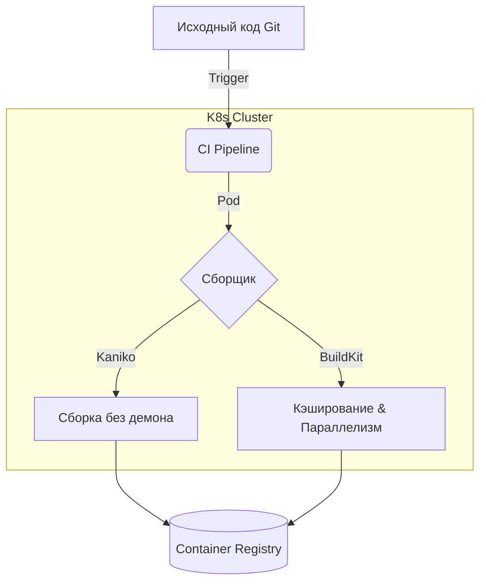

# Сборка (Kaniko, BuildKit)

## DevOps История
**Боль:** Сборка Docker-образов внутри Kubernetes-кластера (CI/CD пайплайны) требует доступа к Docker daemon (DooD, DinD). Это создает огромные дыры в безопасности (привилегированные контейнеры, root-доступ к ноде) и приводит к проблемам с производительностью и кэшированием.
**Решение:** Инструменты daemonless сборки. BuildKit значительно ускоряет классическую сборку за счет распараллеливания и умного кэширования, а Kaniko позволяет безопасно собирать образы внутри изолированных подов Kubernetes без необходимости root-прав или доступа к демону.

## Архитектура



## Примеры (Bash/Docker)

**Использование BuildKit:**
Включите BuildKit перед сборкой (в современных версиях Docker включен по умолчанию):
```bash
DOCKER_BUILDKIT=1 docker build -t myapp:latest .
```
Пример оптимизированного `Dockerfile` с использованием кэша:
```dockerfile
# syntax=docker/dockerfile:1.4
FROM node:18-alpine AS builder
WORKDIR /app
COPY package*.json ./
# Используем кэш npm
RUN --mount=type=cache,target=/root/.npm npm ci
COPY . .
RUN npm run build
```

**Запуск Kaniko в K8s (подобно CI):**
```bash
docker run -v $(pwd):/workspace \
  -v ~/.docker/config.json:/kaniko/.docker/config.json \
  gcr.io/kaniko-project/executor:latest \
  --dockerfile /workspace/Dockerfile \
  --context dir:///workspace \
  --destination myregistry.com/myapp:latest
```

## Day 2 Operations
- **Управление кэшем:** Настройте remote cache (`--cache=true --cache-repo=...` для Kaniko, `type=registry` для BuildKit), чтобы ускорить сборки на эфемерных раннерах.
- **Очистка ресурсов:** Настройте автоматическую сборку мусора на раннерах CI/CD, чтобы кэш BuildKit не забил диски (используйте `docker builder prune`).
- **Мониторинг:** Отслеживайте время сборки в CI. Если оно растет, проверьте, работает ли кэширование слоев и нет ли невалидируемых скачиваний в `RUN` инструкциях.

## Антипаттерны
- ❌ **Слепое копирование всего контекста:** Использование `COPY . .` до установки зависимостей ломает кэш. Сначала копируйте манифесты пакетов, устанавливайте зависимости, потом остальной код.
- ❌ **Docker-in-Docker (DinD) в продакшене/CI:** Использование `/var/run/docker.sock` в CI-подах без явной необходимости.
- ❌ **Игнорирование .dockerignore:** Передача мусора (логов, node_modules, .git) в контекст сборки замедляет процесс и раздувает образ.
