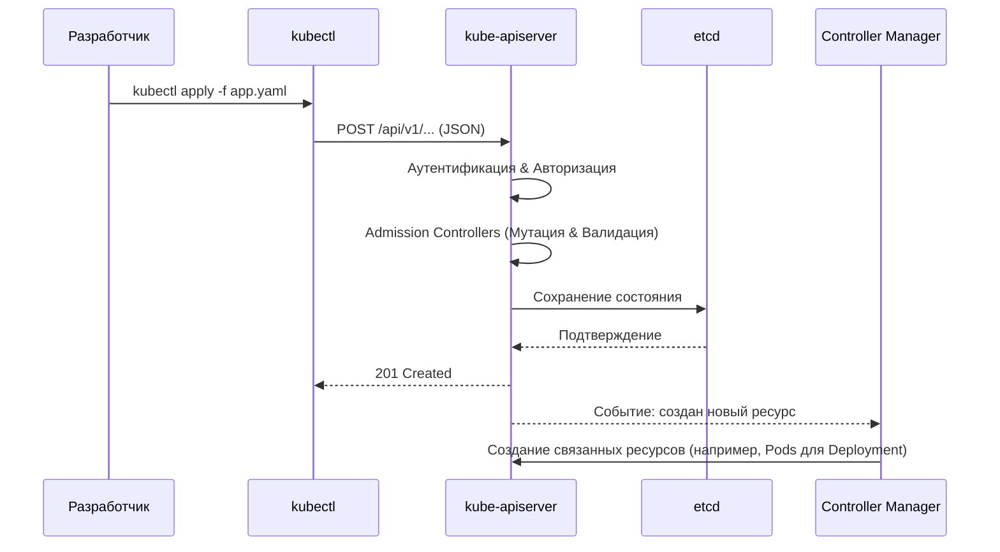

# API Resources и YAML

## 📖 История: От императивного хаоса к декларативной нирване
**Боль:** Мы разворачивали инфраструктуру bash-скриптами. Команды вроде `docker run` и `kubectl create` выполнялись вручную. В итоге никто не знал, как именно настроен production (проблема конфигурационного дрейфа), а повторить среду для стейджинга было невозможно.
**Решение:** Переход к декларативному подходу. Мы больше не говорим системе *КАК* сделать (команды), мы описываем в формате YAML *ЧТО* мы хотим получить (состояние). API-сервер Kubernetes сам решает, как привести текущее состояние к желаемому.

## 🏗 Архитектура: Путь YAML файла


## 🛠 Основные API Ресурсы

1.  **Pod:** Минимальная единица развертывания. Один или несколько контейнеров, делящих сеть и диски.
2.  **Deployment:** Управляет ReplicaSet'ами, обеспечивает декларативное обновление подов (Rolling Updates).
3.  **Service:** Обеспечивает стабильный IP-адрес и DNS-имя для набора подов (LoadBalancing).
4.  **ConfigMap / Secret:** Отделяют конфигурацию (переменные, файлы) и секреты (пароли, ключи) от образа контейнера.
5.  **Ingress:** Управляет внешним доступом к сервисам в кластере (HTTP/HTTPS маршрутизация).

## 💻 Пример (YAML)

Пример простого Deployment:
```yaml
apiVersion: apps/v1
kind: Deployment
metadata:
  name: my-backend
  labels:
    app: backend
spec:
  replicas: 3
  selector:
    matchLabels:
      app: backend
  template: # Это спецификация Pod'а
    metadata:
      labels:
        app: backend
    spec:
      containers:
      - name: app
        image: my-registry.com/app:v1.2.0
        ports:
        - containerPort: 8080
        resources:
          requests:
            cpu: "100m"
            memory: "128Mi"
          limits:
            cpu: "500m"
            memory: "256Mi"
```

Применение манифеста:
```bash
# Применить конфигурацию (создать или обновить)
kubectl apply -f deployment.yaml

# Посмотреть, что получится перед применением
kubectl apply -f deployment.yaml --dry-run=client -o yaml
```

## 🌅 Day 2 Operations (Жизнь после запуска)
*   **GitOps:** Храните все YAML-файлы в Git. Используйте инструменты вроде **ArgoCD** или **Flux**, которые автоматически синхронизируют состояние кластера с репозиторием. "Git is the single source of truth".
*   **Управление манифестами:** Не дублируйте YAML для разных сред (dev/prod). Используйте **Helm** (шаблонизация) или **Kustomize** (оверлеи, встроен в kubectl).
*   **Валидация:** Используйте Admission Controllers (Kyverno или OPA Gatekeeper), чтобы запретить применение плохих YAML (например, без прописанных limits, или запуск от root).

## ⚠️ Антипаттерны (Как делать НЕ надо)
*   **Imperative commands в Prod:** Использование `kubectl run`, `kubectl create`, `kubectl edit`, `kubectl scale` в production. Любое изменение должно проходить через коммит в Git и CI/CD.
*   **Секреты в чистом виде в Git:** YAML-манифесты типа Secret хранят данные в Base64, это не шифрование! Используйте External Secrets Operator или Sealed Secrets для безопасного хранения.
*   **Отсутствие Resource Limits:** Запуск подов без `requests` и `limits`. Один "потекший" под может забрать все ресурсы ноды и убить соседей (Noisy Neighbor).
*   **Использование тэга :latest:** Никогда не используйте `image: my-app:latest`. Kubernetes не обновит контейнер, если образ изменился, и невозможно откатиться на предыдущую версию. Всегда используйте явные теги версий (или SHA-хэши).
