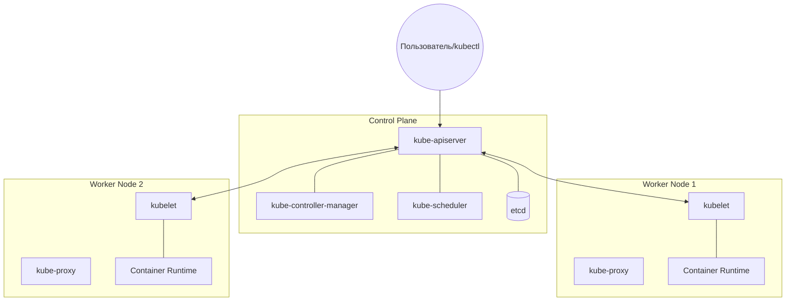

# Control Plane, Worker Nodes, etcd

## 📖 История: От хаоса к оркестрации
**Боль:** Раньше мы запускали десятки микросервисов вручную на разных серверах. Когда сервер падал, приходилось ночью по SSH перезапускать контейнеры. Балансировка нагрузки, сеть и хранение были настроены скриптами, которые никто уже не понимал.
**Решение:** Kubernetes разделил систему на **"мозг"** (Control Plane), который принимает решения, и **"руки"** (Worker Nodes), которые выполняют работу. Состояние всего кластера надежно хранится в распределенной базе данных **etcd**.

## 🏗 Архитектура


## 🛠 Компоненты

### Control Plane (Управляющий слой)
*   **kube-apiserver:** Единственная точка входа. Все компоненты общаются только через него.
*   **etcd:** Key-value хранилище. Единый источник истины (State) о кластере.
*   **kube-scheduler:** Ищет подходящую ноду для запуска новых подов (учитывая ресурсы, affinity/anti-affinity).
*   **kube-controller-manager:** Следит за тем, чтобы фактическое состояние соответствовало желаемому (например, чтобы всегда работало 3 реплики пода).

### Worker Nodes (Рабочие узлы)
*   **kubelet:** Агент на каждой ноде. Получает команды от API-сервера и следит, чтобы нужные контейнеры работали.
*   **kube-proxy:** Управляет сетевыми правилами на ноде, обеспечивая связь между подами и доступ к сервисам.
*   **Container Runtime:** Среда выполнения (containerd, CRI-O, Docker), которая непосредственно запускает контейнеры.

## 💻 Примеры

Проверка состояния нод и компонентов:
```bash
# Посмотреть все ноды в кластере
kubectl get nodes -o wide

# Узнать детали конкретной ноды (capacity, allocatable, conditions)
kubectl describe node <node-name>

# Проверка статуса компонентов control-plane (устаревает, но иногда полезно)
kubectl get componentstatuses
```

## 🌅 Day 2 Operations (Жизнь после запуска)
*   **Резервное копирование etcd:** Регулярно делайте бэкапы (снапшоты) etcd. Без него вы потеряете весь кластер, даже если воркеры живы.
    ```bash
    ETCDCTL_API=3 etcdctl snapshot save snapshot.db
    ```
*   **Мониторинг Control Plane:** Следите за метриками `kube-apiserver` (задержки запросов) и `etcd` (размер БД, disk sync duration). Используйте Prometheus.
*   **High Availability (HA):** В production всегда используйте минимум 3 мастер-ноды (Control Plane) и распределенный etcd (желательно на отдельных дисках).

## ⚠️ Антипаттерны (Как делать НЕ надо)
*   **Запуск рабочих нагрузок на Master нодах:** Не снимайте Taint `node-role.kubernetes.io/master:NoSchedule` (или control-plane). Мастер-ноды должны заниматься только управлением, иначе тяжелый бизнес-под может положить API-сервер.
*   **Игнорирование мониторинга etcd:** Медленный диск под etcd приведет к деградации всего кластера.
*   **Ручное вмешательство в etcd:** Никогда не редактируйте данные в etcd напрямую, всегда используйте Kubernetes API.
