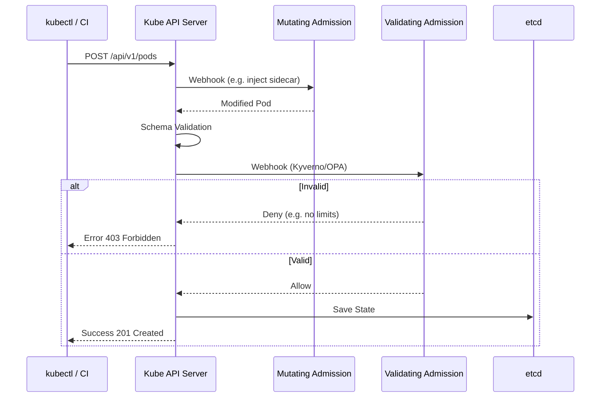

# Admission Controllers (OPA, Kyverno)

## 📖 DevOps Story (Боль и Решение)
**Боль:** Разработчики деплоят поды с правами `privileged`, без лимитов ресурсов и стягивают образы с тегом `latest`. Кластер превращается в нестабильную свалку, а безопасники рвут волосы. Ловить нарушителей на этапе CI/CD поздно или ненадежно.
**Решение:** **Admission Controllers**. Это гейткиперы внутри Kubernetes API, которые перехватывают запросы на создание/изменение ресурсов *до* их сохранения в etcd. Они могут мутировать (изменять) или валидировать (отклонять) объекты по заданным правилам. OPA Gatekeeper и Kyverno — лидеры в этой области.

## 📐 Архитектура (Mermaid)



## 💻 Примеры (YAML/bash)

**Установка Kyverno через Helm:**
```bash
helm repo add kyverno https://kyverno.github.io/kyverno/
helm repo update
helm install kyverno kyverno/kyverno -n kyverno --create-namespace
```

**Пример политики Kyverno: Запрет `latest` тега**
```yaml
apiVersion: kyverno.io/v1
kind: ClusterPolicy
metadata:
  name: disallow-latest-tag
spec:
  validationFailureAction: Enforce # Audit or Enforce
  rules:
  - name: require-image-tag
    match:
      any:
      - resources:
          kinds:
          - Pod
    validate:
      message: "Использование тега latest запрещено!"
      pattern:
        spec:
          containers:
          - image: "!*:latest"
```

## 🛠️ Day 2 Operations
- **Режим Audit сначала:** Всегда выкатывайте новые политики в режиме Audit (`validationFailureAction: Audit`), собирайте метрики/логи нарушения политик и только потом переводите в `Enforce`. Иначе можно случайно сломать прод.
- **Мониторинг Webhooks:** Если ваш Admission Webhook (Kyverno/OPA) упадет, Kube API может перестать принимать *любые* изменения (зависит от `failurePolicy: Fail` или `Ignore`). Настройте алерты на доступность вебхуков!
- **Исключения (Exemptions):** Сразу продумайте механизм исключений для системных неймспейсов (например, `kube-system`).

## ⚠️ Антипаттерны
- **Сложные регулярки в политиках:** Приводят к высокой нагрузке на API server, так как валидация происходит синхронно на каждый запрос.
- **Мутация критичных полей без ведома владельца:** Если Admission Controller неявно меняет важные параметры (например, переменные окружения), это усложняет дебаг для разработчиков (GitOps дрифт).
- **Отсутствие тестирования политик:** Политики — это код. Используйте CLI инструменты (например, `kyverno apply`) для тестирования политик в CI пайплайнах до применения в кластер.
