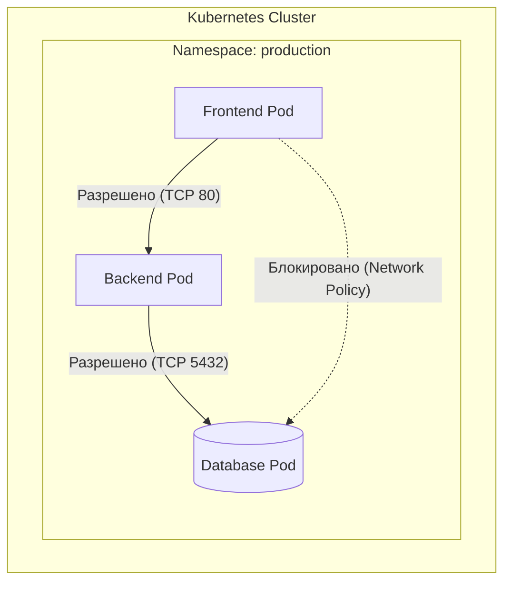

# Network Policies

## DevOps-история: Боль и Решение
**Боль:** Микросервисы в кластере общаются друг с другом без ограничений. Скомпрометированный frontend-контейнер получает полный доступ к базе данных и внутренним API, что приводит к утечке данных.
**Решение:** Внедрение Network Policies (сетевых политик). По умолчанию блокируется весь трафик (Default Deny), а затем разрешаются только необходимые коммуникации между подами (Zero Trust Network).

## Архитектура


## Пример (YAML)

**1. Default Deny Policy (блокирует всё в неймспейсе):**
```yaml
apiVersion: networking.k8s.io/v1
kind: NetworkPolicy
metadata:
  name: default-deny-all
  namespace: production
spec:
  podSelector: {} # Применяется ко всем подам
  policyTypes:
  - Ingress
  - Egress
```

**2. Разрешение трафика от Backend к DB:**
```yaml
apiVersion: networking.k8s.io/v1
kind: NetworkPolicy
metadata:
  name: allow-backend-to-db
  namespace: production
spec:
  podSelector:
    matchLabels:
      app: database
  policyTypes:
  - Ingress
  ingress:
  - from:
    - podSelector:
        matchLabels:
          app: backend
    ports:
    - protocol: TCP
      port: 5432
```

## Day 2 Operations (Советы)
- **Используйте правильный CNI:** Network Policies работают, только если ваш CNI плагин их поддерживает (например, Calico, Cilium, Weave Net). Flannel сам по себе их не поддерживает.
- **Логирование и мониторинг:** Настройте логирование заблокированных пакетов. В Cilium это делается через Hubble, в Calico — через GlobalNetworkPolicy с логированием.
- **Тестируйте перед внедрением:** Внедряйте политики поэтапно, используя режим аудита (если поддерживается CNI), чтобы не сломать работающее приложение.

## Антипаттерны
- **Использование IP-адресов вместо лейблов:** IP-адреса подов меняются постоянно. Всегда используйте `podSelector` и `namespaceSelector`.
- **Забытый Egress:** Часто настраивают только Ingress, оставляя Egress открытым. Скомпрометированный под сможет скачивать скрипты из интернета. Ограничивайте исходящий трафик тоже.
- **Слишком широкие политики:** Использование `namespaceSelector` без `podSelector` внутри может случайно разрешить доступ ненужным подам в том же неймспейсе.
