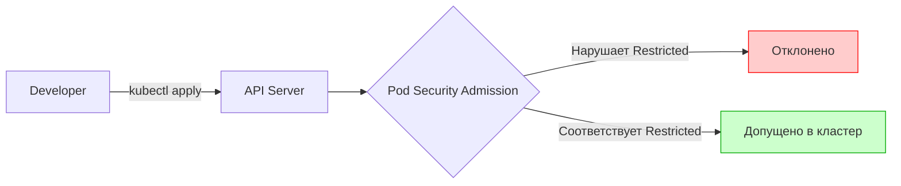

# Pod Security Standards (PSS)

## DevOps-история: Боль и Решение
**Боль:** Разработчик запускает контейнер с правами `root` (`privileged: true`), монтирует `/var/run/docker.sock` или хостовую файловую систему. При взломе контейнера злоумышленник получает полный контроль над узлом (Node) и всем кластером.
**Решение:** Внедрение Pod Security Standards (PSS) через Pod Security Admission (PSA). Кластер автоматически блокирует запуск небезопасных подов на уровне API сервера.

## Архитектура


## Профили PSS
1. **Privileged:** Политика не ограничена. (Для системных агентов, CNI).
2. **Baseline:** Минимальные ограничения (запрет `privileged`, хостовых портов). Для обычных приложений.
3. **Restricted:** Жёсткие ограничения (runAsNonRoot, запрет эскалации привилегий). Для критичных workload'ов.

## Пример (Настройка Namespace)

Контроль PSS осуществляется через лейблы на уровне Namespace.

```bash
# Применить режим enforce для профиля restricted
kubectl label namespace production pod-security.kubernetes.io/enforce=restricted

# Добавить предупреждения (warn) и аудит (audit) для новых профилей, чтобы заранее знать о проблемах
kubectl label namespace production pod-security.kubernetes.io/warn=restricted
kubectl label namespace production pod-security.kubernetes.io/audit=restricted
```

**Пример манифеста, который пройдет Restricted профиль:**
```yaml
apiVersion: v1
kind: Pod
metadata:
  name: secure-pod
  namespace: production
spec:
  securityContext:
    runAsNonRoot: true
    seccompProfile:
      type: RuntimeDefault
  containers:
  - name: app
    image: nginxinc/nginx-unprivileged
    securityContext:
      allowPrivilegeEscalation: false
      capabilities:
        drop:
          - ALL
```

## Day 2 Operations (Советы)
- **Плавная миграция:** Используйте режимы `warn` и `audit` перед включением `enforce`. Это позволит собрать метрики о том, какие поды сломаются, не вызывая инцидентов.
- **Исключения:** Если определённым контроллерам (например, Fluent-bit, Node Exporter) нужны привилегии, выносите их в отдельные неймспейсы с профилем `privileged`, а бизнес-логику держите в `restricted`.
- **Использование Kyverno / OPA Gatekeeper:** Если встроенного PSS не хватает (нужны более сложные условия), используйте сторонние Policy Engines для более гранулярного контроля.

## Антипаттерны
- **Один неймспейс для всего:** Запуск системных демонов и пользовательских приложений в одном неймспейсе вынуждает снижать уровень безопасности для всего неймспейса.
- **Игнорирование SecurityContext в Helm-чартах:** Многие публичные Helm-чарты по умолчанию не соответствуют `restricted` профилю. Их нужно донастраивать через `values.yaml`.
- **Использование устаревшего PSP:** Pod Security Policies (PSP) удалены в Kubernetes v1.25. Использование PSP в старых кластерах без плана миграции на PSS/PSA — это бомба замедленного действия.
