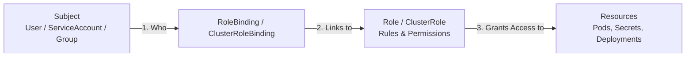

# RBAC и Service Accounts

## 📖 DevOps-история: Боль и Решение
**Боль:** Разработчику понадобился доступ к логам конкретного приложения в Kubernetes. По-быстрому ему выдали kubeconfig с правами `cluster-admin`. Одновременно само приложение запускается с дефолтным ServiceAccount, который из-за старых настроек (или отсутствия изоляции) имеет право читать чужие секреты. Итог закономерен: случайная опечатка джуна или взломанный под (RCE) приводят к компрометации всего кластера и утечке кредов от БД.
**Решение:** **RBAC (Role-Based Access Control)** и выделенные **Service Accounts (SA)**. Доступ выдается строго по принципу наименьших привилегий (Least Privilege). Концепция проста: *Кто* (Subject) + *Что может делать* (Verb) + *С чем* (Resource) = RoleBinding.

## 🏗 Архитектура (Mermaid)


## 💻 Примеры

### Выделенный ServiceAccount с минимальными правами для CI/CD
```yaml
---
apiVersion: v1
kind: ServiceAccount
metadata:
  name: ci-deployer
  namespace: prod
---
apiVersion: rbac.authorization.k8s.io/v1
kind: Role
metadata:
  name: deployment-manager
  namespace: prod
rules:
- apiGroups: ["apps"]
  resources: ["deployments"]
  verbs: ["get", "list", "watch", "create", "update", "patch", "delete"]
---
apiVersion: rbac.authorization.k8s.io/v1
kind: RoleBinding
metadata:
  name: ci-deployer-binding
  namespace: prod
subjects:
- kind: ServiceAccount
  name: ci-deployer
  namespace: prod
roleRef:
  kind: Role
  name: deployment-manager
  apiGroup: rbac.authorization.k8s.io
```

## 🛠 Day 2 Operations
- **Аудит доступов:** Регулярно используйте утилиты вроде `rak` (RBAC lookup), `kubectl who-can` (от Aqua Security) или `kube-score` для проверки, кто реально имеет доступ к критичным ресурсам (например, секретам или exec в поды).
- **OIDC Интеграция:** Никогда не создавайте статических пользователей или x509 сертификаты для людей. Подключайте Kubernetes к корпоративному Identity Provider (Google, Okta, Keycloak) через OIDC. Так вы сможете мапить группы (например, `devops-team`) в ClusterRoleBinding.
- **Токены ServiceAccount:** Начиная с K8s 1.24 токены больше не создаются автоматически как бесконечные Secret. Для внешних систем (например, GitHub Actions) используйте OIDC (Workload Identity) или TokenRequest API с коротким временем жизни токена (Bound Service Account Tokens).

## ❌ Антипаттерны
1. **Wildcards `*` в RBAC:** Использование `verbs: ["*"]` и `resources: ["*"]` в ролях. Это ленивый путь, который часто ведет к скрытой эскалации привилегий (возможность читать Secrets или создавать поды с root-доступом на ноде).
2. **Использование ServiceAccount `default`:** Навешивание кастомных прав на дефолтный SA неймспейса. Любой под без явно указанного SA получит эти права. Всегда создавайте выделенный SA для каждого приложения.
3. **Монтирование токенов без нужды:** Если приложению внутри пода не нужно общаться с Kubernetes API (например, это просто Nginx или бэкенд), оставлять монтирование токена включенным — риск. Всегда ставьте `automountServiceAccountToken: false` на уровне Pod spec или SA.
