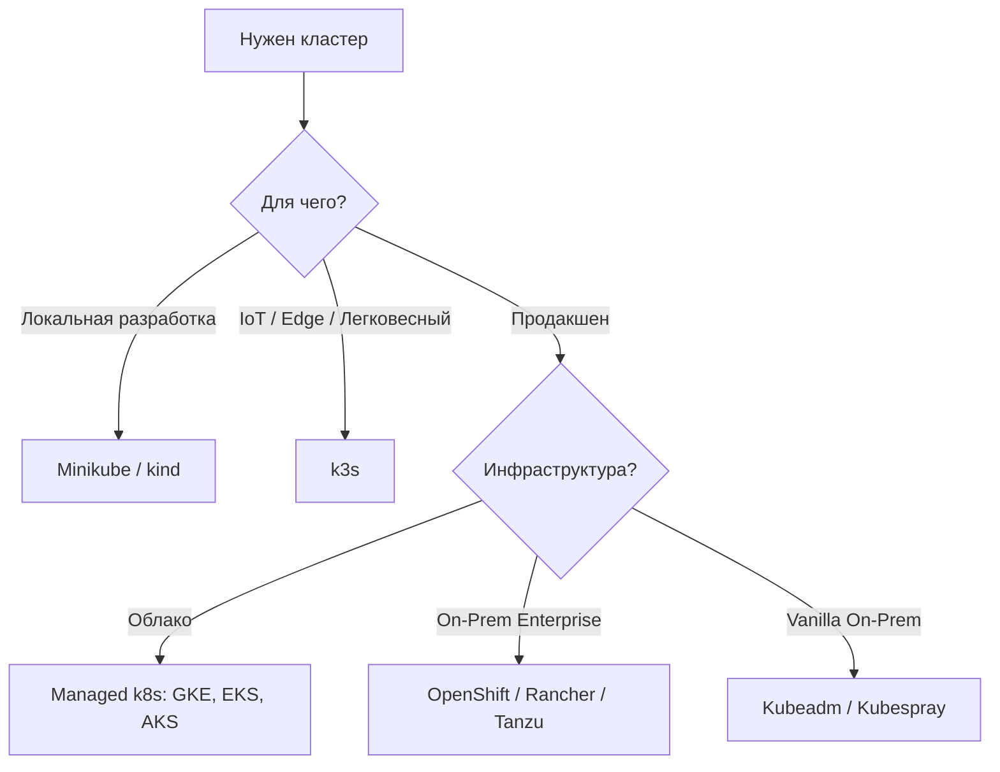

# Дистрибутивы Kubernetes (Minikube, kind, k3s, EKS, GKE, AKS, OpenShift)

## 📖 История: Боль и Решение
**Боль:** Разворачивать Kubernetes "the hard way" (через бинарники, сертификаты, etcd) — это долго, больно и не масштабируется для команд. Разработчикам нужны кластеры "здесь и сейчас", а бизнесу — стабильный продакшен без необходимости нанимать десяток администраторов k8s.
**Решение:** Использовать готовые дистрибутивы (k3s) для edge/iot, локальные утилиты (minikube, kind) для разработчиков и managed-решения (EKS, GKE, AKS) или Enterprise-платформы (OpenShift) для продакшена.

## 🗺️ Архитектура выбора дистрибутива


## 💻 Примеры

**Создание кластера kind (Kubernetes in Docker):**
```bash
# Создание кластера с кастомной конфигурацией
cat <<EOF | kind create cluster --config=-
kind: Cluster
apiVersion: kind.x-k8s.io/v1alpha4
nodes:
- role: control-plane
- role: worker
- role: worker
EOF
```

**Развертывание k3s (легковесный дистрибутив):**
```bash
curl -sfL https://get.k3s.io | sh -
# Проверка
kubectl get nodes
```

## 🛠️ Day 2 Operations
- **Infrastructure as Code (IaC):** Все облачные кластеры (EKS, GKE) должны создаваться только через Terraform/Pulumi, а не через Web UI. Это обеспечивает воспроизводимость.
- **Унификация сред:** Старайтесь, чтобы версии k8s в локальном (kind) и облачном (EKS) кластерах совпадали.
- **Автоматизация апдейтов:** В Managed k8s настройте maintenance windows для автоматического обновления patch-версий.

## ⚠️ Антипаттерны
- **Вендор-лок:** Использование слишком большого количества специфичных для облака аннотаций (например, AWS-specific Ingress controllers), если есть потенциальный риск миграции в другое облако.
- **"Снежинки" в managed-сервисах:** Ручное изменение конфигурации нод в managed кластерах (например, через SSH), которые потом перезатрутся при автоскейлинге.
- **Minikube для нагрузочного тестирования:** Попытки проводить серьезное нагрузочное тестирование на локальном кластере разработчика.
