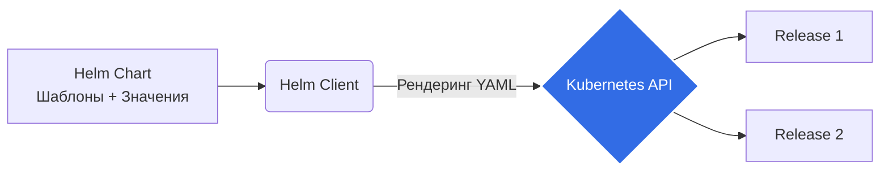

# 00 Основы Helm

## 📖 История: Боль и Решение
**Боль:** Деплой сложных приложений в Kubernetes требует управления десятками YAML-манифестов (Deployment, Service, Ingress, ConfigMap, Secret). Изменение даже одной переменной (например, версии образа) означает ручной поиск и замену во многих файлах. Разворачивать одно и то же приложение в разных окружениях (dev, stage, prod) становится кошмаром копипасты.

**Решение:** **Helm** — это пакетный менеджер для Kubernetes (как `apt` для Ubuntu или `npm` для Node.js). Он позволяет упаковать все манифесты приложения в один логический юнит (Chart), шаблонизировать их и управлять версиями релизов.

## 📐 Архитектура и Workflow


## 💻 Базовые примеры (bash)
```bash
# Добавление репозитория
helm repo add bitnami https://charts.bitnami.com/bitnami
helm repo update

# Поиск чарта
helm search repo nginx

# Установка чарта (создание релиза)
helm install my-nginx bitnami/nginx -n web-ns --create-namespace

# Просмотр установленных релизов
helm ls -n web-ns

# Удаление релиза
helm uninstall my-nginx -n web-ns
```

## 🛠 Day 2 Operations
- **Управление историей:** Helm хранит историю релизов (обычно в Secret'ах в неймспейсе релиза). Вы всегда можете откатиться: `helm rollback <release_name> <revision>`.
- **Лимиты ревизий:** По умолчанию Helm хранит 10 ревизий. В production рекомендуется держать разумный лимит, чтобы не раздувать etcd: `helm upgrade ... --history-max 5`.
- **Dry-run & Debug:** Перед апгрейдом всегда используйте `helm upgrade --dry-run --debug` или плагин `helm-diff`, чтобы увидеть, какие конкретно изменения применятся к кластеру.

## ⛔ Антипаттерны
- **Всё в одном гигантском чарте:** Не пытайтесь упаковать весь ваш микросервисный зоопарк в один гигантский моно-чарт. Используйте механизмы зависимостей (subcharts) или отдельные релизы.
- **Хранение секретов в plain-text values:** Не коммитьте пароли в `values.yaml`. Используйте плагины вроде `helm-secrets` (с SOPS), External Secrets Operator или подставляйте значения в CI/CD пайплайне (`--set`).
- **Игнорирование `helm test`:** Чарт установлен, но работает ли приложение? Забывают писать тесты, проверяющие базовую работоспособность сервиса после деплоя.
