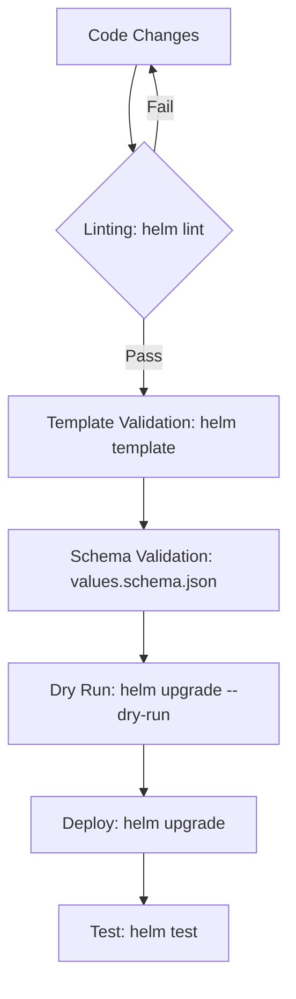

# Helm: Best Practices

## 📖 История одной боли (Pain & Solution)
**Боль:** По мере роста количества микросервисов Helm-чарты превращаются в нечитаемую кашу. Команды копипастят YAML, захардкоживают значения, и изменение одного лейбла требует правок в десятках мест. Обновления становятся страшным сном, так как непонятно, что и где сломается.
**Решение:** Следование **Helm Best Practices** — создание переиспользуемых, читаемых и безопасных шаблонов, использование встроенных функций (helpers), линтеров и правильной структуры `values.yaml`.

## 🔄 Жизненный цикл идеального чарта (Mermaid)



## 🛠 Основные правила и примеры

### 1. Используйте хелперы (`_helpers.tpl`)
Не хардкодьте имена, используйте стандартизированные шаблоны. Это гарантирует отсутствие конфликтов имен в кластере:
```yaml
# Плохо
name: my-app-{{ .Values.environment }}

# Хорошо
name: {{ include "my-app.fullname" . }}
```

### 2. Структурируйте `values.yaml` логически
Избегайте плоской структуры. Группируйте параметры по компонентам:
```yaml
# Плохо
imageName: nginx
imageTag: latest
servicePort: 80

# Хорошо
image:
  repository: nginx
  tag: latest
service:
  port: 80
```

### 3. Защита от дурака (values.schema.json)
Описывайте JSON-схему для ваших `values.yaml`, чтобы Helm строго валидировал их перед деплоем:
```json
{
  "$schema": "http://json-schema.org/schema#",
  "type": "object",
  "properties": {
    "replicaCount": {
      "type": "integer",
      "minimum": 1
    }
  }
}
```

## 📅 Day 2 Operations
- **Версионирование:** Всегда инкрементируйте версию чарта (`version` в `Chart.yaml`) при любых изменениях в шаблонах. Версию приложения (`appVersion`) меняйте только при обновлении самого образа.
- **Тестирование:** Пишите тесты (ресурсы с аннотацией `helm.sh/hook: test`), чтобы проверять работоспособность приложения после деплоя (например, `curl` под на эндпоинт `/health`).
- **Dry-run и Diff:** Перед применением на проде используйте плагин `helm-diff` (`helm diff upgrade my-release my-chart/`), чтобы увидеть точечные изменения манифестов, а не гадать, что произойдет.

## 🚫 Антипаттерны
- **Слишком универсальный (Мега) чарт:** Попытка написать один чарт, который поддерживает абсолютно всё (CronJobs, StatefulSets, Ingress, Istio, Vault). Это приводит к тысячам строк IF/ELSE, которые невозможно читать и поддерживать. Делайте чарты узконаправленными или используйте Library Charts.
- **Хранение секретов в `values.yaml`:** Никогда не коммитьте пароли и токены открытым текстом. Используйте `helm-secrets` (в связке с SOPS) или внешние системы вроде External Secrets Operator.
