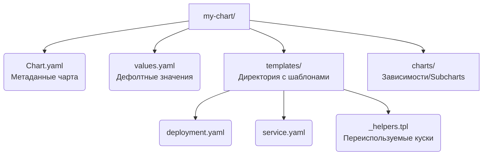

# Charts, Templates, Values

## 📖 История: Боль и Решение
**Боль:** У вас есть готовые YAML-манифесты приложения, и теперь нужно развернуть его на production. Но там нужны другие лимиты ресурсов, другой URL базы данных и больше реплик. Дублировать файлы для каждого окружения — прямой путь к рассинхронизации и ошибкам.

**Решение:** Разделение логики и данных. Helm вводит концепцию **Шаблонов (Templates)**, где пишутся манифесты с плейсхолдерами (на базе Go text/template), и **Значений (Values)** — файлов конфигурации (`values.yaml`), которые подставляются в эти шаблоны при рендеринге. Всё это упаковывается в директорию со строгой структурой — **Chart**.

## 📐 Структура Helm Chart


## 💻 Пример шаблонизации (YAML)

**1. `values.yaml` (Данные):**
```yaml
replicaCount: 3
image:
  repository: nginx
  tag: "1.21.6"
resources:
  requests:
    cpu: 100m
    memory: 128Mi
```

**2. `templates/deployment.yaml` (Шаблон):**
```yaml
apiVersion: apps/v1
kind: Deployment
metadata:
  name: {{ include "my-chart.fullname" . }}
spec:
  replicas: {{ .Values.replicaCount }}
  template:
    spec:
      containers:
        - name: app
          image: "{{ .Values.image.repository }}:{{ .Values.image.tag }}"
          resources:
            {{- toYaml .Values.resources | nindent 12 }}
```

## 🛠 Day 2 Operations
- **Иерархия значений:** Помните порядок приоритетов при мердже конфигураций: 
  `values.yaml` (самый низкий) -> `--values prod.yaml` (файл окружения) -> `--set key=value` (самый высокий).
- **Валидация JSON Schema:** Используйте файл `values.schema.json` в корне чарта, чтобы валидировать типы и обязательность параметров, которые вам передают пользователи чарта.
- **Отладка рендеринга:** Команда `helm template my-release ./my-chart -f values.yaml` покажет чистый YAML, который полетит в Kubernetes, без реальной установки. Это лучший друг при разработке сложных шаблонов.

## ⛔ Антипаттерны
- **Чрезмерная шаблонизация (YAML Spaghetti):** Желание сделать чарт "универсальным для всего на свете" приводит к монструозным `if-else` конструкциям, которые невозможно читать и поддерживать. Делайте чарты узконаправленными.
- **Жесткое кодирование (Hardcoding):** Оставление имен пространств имен или конкретных URL прямо в шаблонах. Всё, что может измениться между окружениями, должно быть вынесено в `values.yaml`.
- **Неиспользование `_helpers.tpl`:** Копипаста одних и тех же конструкций (например, формирование общих лейблов) по всем файлам в `templates/` вместо создания именованных шаблонов (`define`).
