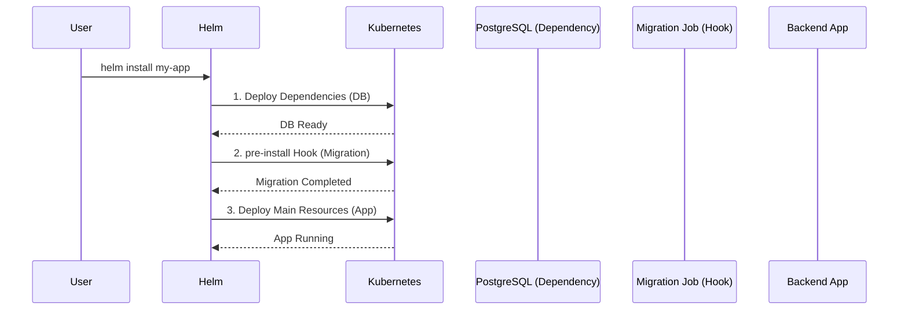

# Helm: Dependencies и Hooks

## 📖 История одной боли (Pain & Solution)
**Боль:** Вы разворачиваете сложное приложение. База данных должна запуститься первой, затем нужно накатить миграции, и только потом стартовать бэкенд. Если делать это обычными манифестами, поды бэкенда будут падать в `CrashLoopBackOff`, ожидая БД, а миграции придется запускать руками.
**Решение:** **Helm Dependencies (Subcharts)** позволяют управлять внешними зависимостями (например, поднять PostgreSQL вместе с вашим приложением), а **Helm Hooks** дают возможность вклиниваться в жизненный цикл релиза (например, запустить `Job` с миграциями строго до запуска основных подов).

## 🔄 Архитектура (Mermaid)



## 🛠 Примеры

### 1. Dependencies (Chart.yaml)
Описываем зависимости прямо в `Chart.yaml`:
```yaml
apiVersion: v2
name: my-backend
version: 1.0.0
dependencies:
  - name: postgresql
    version: 12.1.0
    repository: https://charts.bitnami.com/bitnami
    condition: postgresql.enabled
```
*Совет:* Чтобы скачать зависимости, выполните `helm dependency update`.

### 2. Hooks (Job для миграций)
Добавляем аннотации в манифест `Job`:
```yaml
apiVersion: batch/v1
kind: Job
metadata:
  name: {{ include "my-app.fullname" . }}-migration
  annotations:
    "helm.sh/hook": pre-install,pre-upgrade
    "helm.sh/hook-weight": "-5"
    "helm.sh/hook-delete-policy": hook-succeeded
spec:
  template:
    spec:
      containers:
        - name: migrate
          image: my-backend:latest
          command: ["npm", "run", "migrate"]
      restartPolicy: Never
```

## 📅 Day 2 Operations
- **Управление зависимостями:** Держите зависимости залоченными (`Chart.lock`), коммитьте его в Git, чтобы гарантировать одинаковые версии сабчартов во всех окружениях.
- **Очистка хуков:** Используйте политику `hook-succeeded` или `before-hook-creation` для `helm.sh/hook-delete-policy`. Иначе старые Job'ы останутся висеть в кластере и будут мешать новым релизам из-за конфликта имен.

## 🚫 Антипаттерны
- **Использование хуков для долгоживущих ресурсов:** Хуки созданы для коротких задач (миграции, бэкапы, тесты). Не создавайте через них `Deployment` или `StatefulSet` — Helm потеряет нормальный контроль над их обновлениями и удалением.
- **Отсутствие весов (hook-weight):** Если у вас несколько хуков на одной фазе (например, создать секрет, потом запустить миграцию), отсутствие весов приведет к непредсказуемому порядку выполнения.
