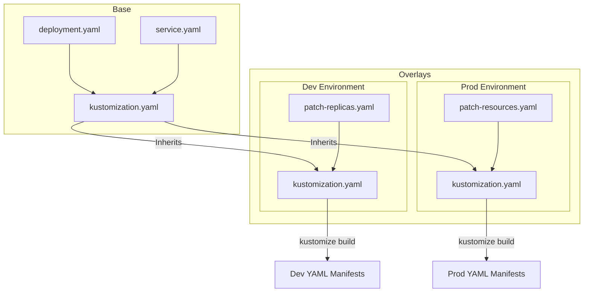

# Kustomize

## 📖 История: Боль и Решение

**Боль:** У вас есть микросервис, который деплоится в Dev, Staging и Prod. Среды похожи, но отличаются деталями: количество реплик, ресурсы, теги образов, Ingress домены. Если копировать YAML, получается "дублирование кода" (YAML hell) и дрифт конфигураций. Если использовать Helm, приходится писать сложный Go-шаблонизатор, превращая читаемый YAML в месиво из `{{ if .Values.env }}`.

**Решение:** **Kustomize** — это встроенный в K8s (`kubectl apply -k`) инструмент конфигурации "без шаблонов". Он использует подход *Base and Overlays* (База и Наложения). Вы держите чистые базовые K8s манифесты в одной папке, а для каждой среды создаете папку `overlay`, где лежат только патчи (diff'ы), которые нужно применить к базе. Никаких переменных и циклов, только чистый декларативный YAML.

## 🏗 Архитектура



## 💻 Примеры

### Структура директорий
```text
├── base/
│   ├── deployment.yaml
│   ├── service.yaml
│   └── kustomization.yaml
└── overlays/
    ├── dev/
    │   └── kustomization.yaml
    └── prod/
        ├── kustomization.yaml
        └── replica-patch.yaml
```

### base/kustomization.yaml
```yaml
apiVersion: kustomize.config.k8s.io/v1beta1
kind: Kustomization
resources:
  - deployment.yaml
  - service.yaml
```

### overlays/prod/kustomization.yaml
```yaml
apiVersion: kustomize.config.k8s.io/v1beta1
kind: Kustomization
bases:
  - ../../base
namePrefix: prod-
commonLabels:
  env: production
images:
  - name: my-app
    newTag: v1.2.0
patchesStrategicMerge:
  - replica-patch.yaml
```

### overlays/prod/replica-patch.yaml
```yaml
# Это патч, который будет наложен поверх deployment.yaml из base
apiVersion: apps/v1
kind: Deployment
metadata:
  name: my-app
spec:
  replicas: 5
```

### Применение
```bash
# Просмотр итогового YAML перед деплоем
kubectl kustomize overlays/prod/

# Применение в кластер
kubectl apply -k overlays/prod/
```

## 🛠 Day 2 Operations (Советы по эксплуатации)

1. **Генераторы ConfigMap/Secret:** Используйте `configMapGenerator` и `secretGenerator` в `kustomization.yaml`. Kustomize будет автоматически добавлять хэш содержимого к имени ConfigMap и обновлять ссылки в Deployment. Это решает проблему перезапуска подов при изменении конфигов (поды автоматически пересоздадутся с новым ConfigMap).
2. **Интеграция с GitOps:** Kustomize идеально работает в связке с ArgoCD и FluxCD. Оба инструмента поддерживают его "из коробки" и предпочитают его для управления конфигурациями сред.
3. **Управление образами:** Используйте директиву `images` (как в примере выше) для подмены тегов образов в CI/CD пайплайнах с помощью команды `kustomize edit set image my-app=registry/my-app:git-sha`.

## ❌ Антипаттерны

- **Глубокая вложенность (Многоэтажные Overlays):** Создание базы, потом overlay `common`, потом overlay `eu-region`, потом overlay `eu-prod`. Ограничивайтесь максимум двумя уровнями (Base -> Overlay). Иначе отладка "откуда прилетел этот лейбл" станет кошмаром.
- **Попытка использовать Kustomize для ветвления логики:** Kustomize не поддерживает `if/else`. Если вам нужно включать/выключать большие куски инфраструктуры в зависимости от среды (например, деплоить Redis в Dev, но использовать AWS ElastiCache в Prod), лучше использовать Helm. Kustomize хорош для изменения значений, а не структуры.
- **Изменение Base для нужд одного Overlay:** База должна быть полностью рабочей сама по себе. Не ломайте `base`, чтобы удовлетворить требования специфичного `overlay`.
