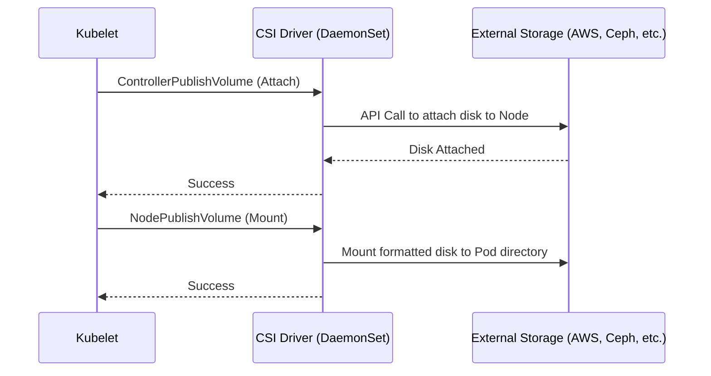

# Container Storage Interface (CSI)

## История боли и решение
**Боль:** Раньше интеграции со всеми системами хранения (AWS EBS, Ceph, vSphere) были встроены прямо в ядро Kubernetes (in-tree). Это раздувало код, заставляло вендоров ждать релизов K8s для исправления багов в своих плагинах и создавало угрозу безопасности (плагины работали с привилегиями K8s).
**Решение:** Внедрение стандарта **CSI** (out-of-tree). Это стандартный интерфейс, позволяющий вендорам хранилищ писать свои плагины (драйверы) и устанавливать их как обычные поды, не трогая исходный код Kubernetes.

## Архитектура (Mermaid)


## Примеры (YAML/bash)

### Установка CSI драйвера (пример с Helm для AWS EBS)
```bash
# Добавление репозитория
helm repo add aws-ebs-csi-driver https://kubernetes-sigs.github.io/aws-ebs-csi-driver
helm repo update

# Установка драйвера
helm upgrade --install aws-ebs-csi-driver \
    --namespace kube-system \
    aws-ebs-csi-driver/aws-ebs-csi-driver
```

### StorageClass, использующий CSI
```yaml
apiVersion: storage.k8s.io/v1
kind: StorageClass
metadata:
  name: ebs-sc
provisioner: ebs.csi.aws.com # Указание CSI драйвера
volumeBindingMode: WaitForFirstConsumer
parameters:
  type: gp3
  encrypted: "true"
```

## Day 2 Operations (Советы)
- **Snapshots:** Используйте VolumeSnapshots (часть CSI стандарта) для создания консистентных бэкапов перед мажорными апдейтами БД.
- **Troubleshooting:** Если PVC висит в статусе `Pending`, всегда проверяйте логи CSI-контроллера (обычно это под с именем `csi-provisioner` или `csi-attacher` в kube-system или namespace драйвера).
- **VolumeBindingMode:** Используйте `WaitForFirstConsumer` в StorageClass для облаков. Это гарантирует, что диск будет создан в той же зоне доступности, куда зашедулится под.

## Антипаттерны
- ❌ **Использование устаревших in-tree плагинов:** Использование старых провижинеров (например, `kubernetes.io/aws-ebs`). Они deprecated и удаляются. Всегда мигрируйте на CSI.
- ❌ **Слепое обновление CSI драйвера:** Обновление драйвера без чтения changelog. Изменения в CSI могут сломать маунтинг томов на работающих подах при их рестарте.
- ❌ **Игнорирование лимитов нод:** Забывать, что облачные провайдеры имеют лимит на количество присоединенных дисков (attachments) к одной ноде.
