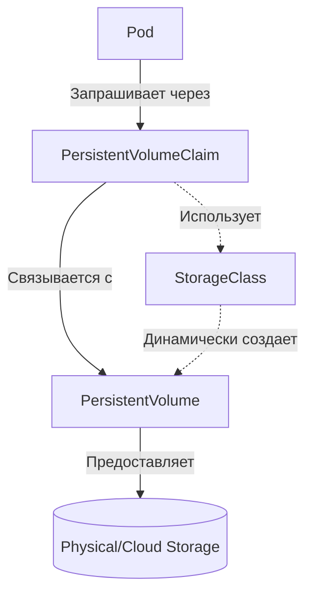

# Volumes, PV, PVC, StorageClass

## История боли и решение
**Боль:** Контейнеры эфемерны. При падении или перезапуске пода (Pod) все данные внутри него исчезают. Разработчики плакали, теряя базы данных после каждого OOMKilled.
**Решение:** Kubernetes ввел абстракции для хранения данных — `Volumes` (тома), привязанные к жизненному циклу пода, и подсистему `PersistentVolume` (PV) / `PersistentVolumeClaim` (PVC) для постоянного хранения данных независимо от подов. `StorageClass` (SC) позволил динамически заказывать хранилища нужного типа "на лету".

## Архитектура (Mermaid)


## Примеры (YAML/bash)

### Динамическое выделение (PVC + StorageClass)
```yaml
apiVersion: v1
kind: PersistentVolumeClaim
metadata:
  name: my-pvc
spec:
  accessModes:
    - ReadWriteOnce
  storageClassName: standard # Ссылка на StorageClass
  resources:
    requests:
      storage: 10Gi
---
apiVersion: v1
kind: Pod
metadata:
  name: my-pod
spec:
  containers:
    - name: app
      image: nginx
      volumeMounts:
        - mountPath: "/var/www/html"
          name: my-storage
  volumes:
    - name: my-storage
      persistentVolumeClaim:
        claimName: my-pvc
```

## Day 2 Operations (Советы)
- **Мониторинг:** Настройте алерты на использование PV (например, через kube-prometheus-stack), чтобы диски не забивались на 100%. `kubelet_volume_stats_capacity_bytes` и `kubelet_volume_stats_used_bytes`.
- **Ресайз:** Убедитесь, что ваш `StorageClass` поддерживает `allowVolumeExpansion: true`. Для увеличения размера просто отредактируйте PVC: `kubectl edit pvc <name>` и увеличьте `storage`.
- **Reclaim Policy:** Тщательно выбирайте политику (Retain, Delete). Для БД всегда используйте `Retain`, чтобы избежать случайного удаления данных при удалении PVC.

## Антипаттерны
- ❌ **Жесткая привязка к PV:** Создание статических PV и ручное связывание их с PVC по имени в облачных средах. Используйте динамический провижининг через StorageClass.
- ❌ **HostPath в проде:** Использование `hostPath` для хранения персистентных данных. Если под переедет на другую ноду, он потеряет доступ к своим данным.
- ❌ **Один RWX том для всего:** Использование ReadWriteMany для баз данных или высоконагруженных I/O приложений. Это сильно бьет по производительности из-за сетевых накладных расходов.
