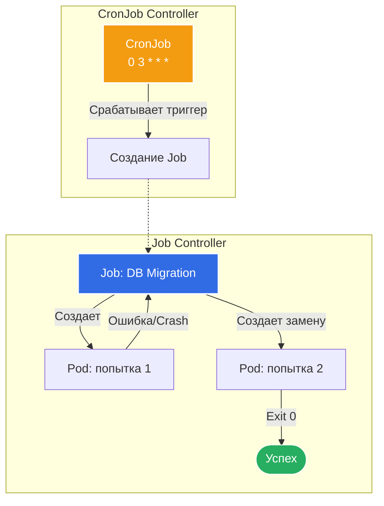

# Jobs и CronJobs

## 📖 История из окопов (Боль и Решение)

**Боль:** 
Ваша команда релизит новую версию приложения. Перед запуском нового кода нужно применить миграции базы данных. Если запустить миграции через `Deployment`, то после успешного выполнения скрипта процесс завершится с кодом `0`. Но `Deployment` решит, что под "упал" и начнет перезапускать его снова и снова (CrashLoopBackOff). Как сказать Kubernetes: "Сделай эту задачу ровно один раз, и если она завершилась успешно — больше не трогай"? 

А что делать с бэкапами базы, которые нужно запускать каждую ночь в 03:00? Писать внешние скрипты с SSH-подключением?

**Решение:** 
Использовать **Job** и **CronJob**. 
* **Job** создает один или несколько подов и гарантирует, что заданное число подов успешно завершится (выполнит задачу и умрет). 
* **CronJob** — это надстройка над Job, которая управляет созданием объектов Job по расписанию, используя классический синтаксис Cron.

---

## 🏗 Архитектура и логика работы



---

## 💻 Примеры

### Манифест Job (Миграция БД)
```yaml
apiVersion: batch/v1
kind: Job
metadata:
  name: db-migrate-v2
spec:
  # Количество попыток перед признанием Job полностью проваленным
  backoffLimit: 3 
  # Сколько подов должны успешно завершиться
  completions: 1
  template:
    spec:
      # Важно: для Job всегда OnFailure или Never. По умолчанию Always (как у Deployment), что вызовет ошибку
      restartPolicy: OnFailure 
      containers:
      - name: migrate
        image: myapp-migrate:v2.0.0
        command: ["/bin/sh", "-c", "migrate -path=/migrations -database=$DB_URL up"]
        env:
        - name: DB_URL
          valueFrom:
            secretKeyRef:
              name: db-credentials
              key: url
```

### Манифест CronJob (Ночной бэкап)
```yaml
apiVersion: batch/v1
kind: CronJob
metadata:
  name: pg-backup
spec:
  schedule: "0 3 * * *" # Каждый день в 03:00
  # Если кластер был недоступен во время старта, запустим пропущенную джобу в течение 600 секунд
  startingDeadlineSeconds: 600
  # Что делать, если предыдущий бэкап еще не закончился? (Allow / Forbid / Replace)
  concurrencyPolicy: Forbid 
  # Сколько успешных и упавших Job оставлять в истории (для дебага)
  successfulJobsHistoryLimit: 3
  failedJobsHistoryLimit: 1
  jobTemplate:
    spec:
      template:
        spec:
          restartPolicy: OnFailure
          containers:
          - name: backup
            image: pg-backup:latest
            command: ["/backup.sh"]
```

### Полезные команды (Bash)
```bash
# Создать Job из CronJob вручную (очень полезно для проверки перед расписанием)
kubectl create job --from=cronjob/pg-backup manual-backup-001

# Посмотреть логи выполнения (внимание: нужно брать имя сгенерированного пода)
kubectl logs -l job-name=db-migrate-v2

# Удалить Job (это удалит и связанные с ним Completed/Failed поды)
kubectl delete job db-migrate-v2
```

---

## 🛠 Day 2 Operations (Советы по эксплуатации)

1. **TTL Controller для автоматической очистки:**
   Kubernetes может оставлять тысячи завершенных подов от Job, забивая базу etcd. Используйте поле `ttlSecondsAfterFinished` в спецификации Job, чтобы кластер сам удалял объект (и поды) через N секунд после завершения.
2. **Идемпотентность — ваше всё:**
   Поды в Kubernetes смертны. Ваш скрипт внутри Job может упасть на середине, и Job запустит его заново. Убедитесь, что ваш код миграции или бэкапа является *идемпотентным* (повторный запуск не ломает данные).
3. **ConcurrencyPolicy (Политика параллелизма):**
   Всегда настраивайте `concurrencyPolicy: Forbid` для CronJob, если задачи тяжелые (например, бэкапы БД). Иначе медленный бэкап породит "снежный ком" из десятков параллельно бегущих Job, которые в итоге положат саму базу данных.

---

## 🛑 Антипаттерны (Как делать не надо)

* ❌ **Запуск бесконечных процессов в Job:** Серверы приложений (Nginx, API, фоновые воркеры на очередях) не должны запускаться как Job. Job ожидает, что процесс когда-нибудь закончится с кодом `0`.
* ❌ **Использование `restartPolicy: Always`:** Это самая частая ошибка новичков. Kubernetes просто не примет такой манифест, но попытки скопипастить кусок Deployment в Job случаются постоянно. Только `Never` или `OnFailure`.
* ❌ **Оставление мусора:** Ненастроенные `historyLimit` в CronJob или отсутствие `ttlSecondsAfterFinished` в обычных Job приводят к тому, что при выполнении `kubectl get pods` вы видите простыню из тысяч подов в статусе `Completed`. Это затрудняет мониторинг и нагружает API-сервер.
