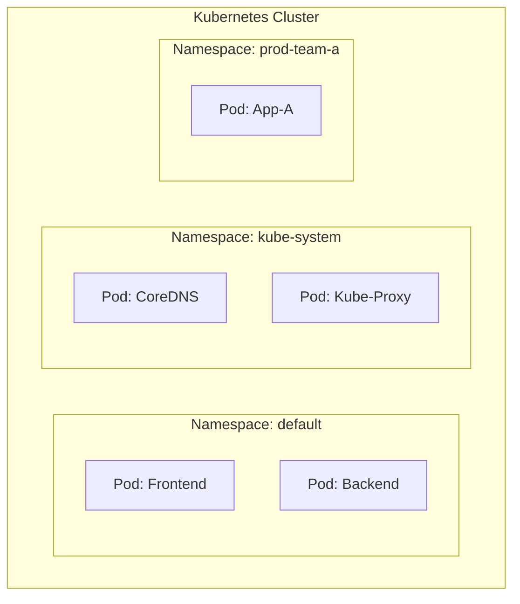

# Kubernetes Namespaces

## 📖 DevOps Story
**Боль:** Все команды деплоят свои приложения в один кластер. Начинается хаос: конфликты имен ресурсов, случайное удаление чужих подов, невозможность разграничить доступ и квоты. 
**Решение:** `Namespaces` (Пространства имен) — виртуальные кластеры внутри одного физического кластера Kubernetes. Они обеспечивают логическую изоляцию ресурсов, управление доступом (RBAC) и ограничение потребления (ResourceQuotas).

## 📊 Архитектура (Mermaid)



## 💻 Примеры (YAML/Bash)

**Создание Namespace (YAML):**
```yaml
apiVersion: v1
kind: Namespace
metadata:
  name: prod-team-a
  labels:
    environment: production
    team: team-a
```

**Полезные команды:**
```bash
# Создать неймспейс императивно
kubectl create ns dev-env

# Просмотр ресурсов в определенном неймспейсе
kubectl get pods -n dev-env

# Смена неймспейса по умолчанию в текущем контексте (как cd для k8s)
kubectl config set-context --current --namespace=dev-env
```

## 🛠 Day 2 Operations
- **ResourceQuotas и LimitRanges:** Обязательно настраивайте квоты для каждого namespace, чтобы одна команда не "съела" все ресурсы кластера (Noisy Neighbor).
- **Network Policies:** Изолируйте сетевой трафик между namespace по умолчанию. Разрешайте только необходимые взаимодействия.
- **Мониторинг и Биллинг:** Настройте алерты и сбор метрик на потребление ресурсов с разбивкой по namespace для Chargeback.
- **Удаление:** Будьте осторожны! Удаление namespace удалит *все* ресурсы внутри него. Процесс может зависнуть (Terminating state) из-за финализаторов (finalizers), требуя ручного вмешательства.

## 🚫 Антипаттерны
- **Использование только `default`:** Деплой всех сервисов в `default` namespace в production. Это путь к хаосу.
- **Микро-неймспейсы:** Создание отдельного namespace для каждого микросервиса одной системы. Лучше группировать по командам или логическим окружениям.
- **Жесткое кодирование:** Указание namespace прямо в манифестах приложения `metadata.namespace`. Лучше передавать его во время деплоя через CI/CD (Helm/Kustomize/kubectl -n).
