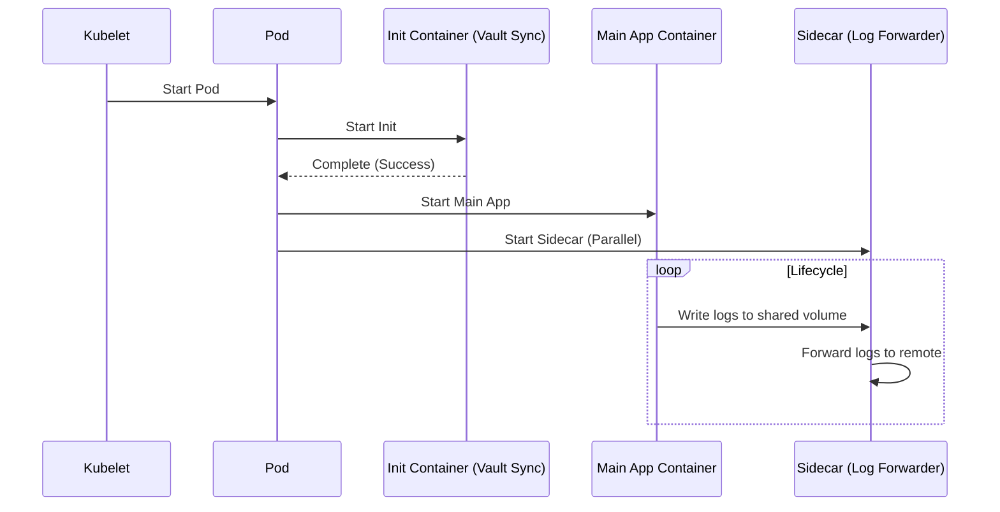

# Kubernetes Pods (Init, Sidecar)

## 📖 DevOps Story
**Боль:** Приложению нужно скачать конфигурацию из Vault до старта, а во время работы — собирать логи и отправлять их в Elasticsearch. При этом не хочется усложнять код самого приложения инфраструктурными задачами.
**Решение:** Паттерны `Init Containers` и `Sidecar Containers` внутри одного Pod'а. 
- **Init Containers:** Отрабатывают последовательно до запуска основных контейнеров (идеально для подготовки окружения, миграций БД).
- **Sidecar Containers:** Работают параллельно с основным приложением, расширяя его функционал (логирование, Service Mesh прокси, экспорт метрик).

## 📊 Архитектура (Mermaid)



## 💻 Примеры (YAML)

**Pod с Init и Sidecar контейнерами:**
```yaml
apiVersion: v1
kind: Pod
metadata:
  name: web-app-pod
spec:
  volumes:
  - name: shared-logs
    emptyDir: {}
  
  initContainers:
  - name: init-config
    image: busybox:1.28
    command: ['sh', '-c', 'echo "Fetching config..." && sleep 2']
    
  containers:
  - name: main-web-app
    image: nginx:1.25
    volumeMounts:
    - name: shared-logs
      mountPath: /var/log/nginx
      
  - name: log-sidecar
    image: busybox:1.28
    # Sidecar читает логи из общей папки
    command: ['sh', '-c', 'tail -f /var/log/nginx/access.log']
    volumeMounts:
    - name: shared-logs
      mountPath: /var/log/nginx
```

## 🛠 Day 2 Operations
- **Ресурсы (Requests/Limits):** Помните алгоритм K8s! Ресурсы пода рассчитываются как `MAX(Сумма ресурсов init-контейнеров, Сумма ресурсов основных контейнеров)`. Тяжелый init-контейнер может зарезервировать ресурсы, которые потом будут простаивать.
- **Native Sidecars (K8s 1.28+):** Используйте фичу `SidecarContainers` (указав `restartPolicy: Always` для init-контейнера). Это решает старую боль с зависанием Job'ов из-за работающего sidecar и гарантирует правильный порядок старта/остановки.
- **Shared Volumes:** Для общения между контейнерами в поде используйте `emptyDir` тома. Это самый быстрый и надежный способ передать данные от init-контейнера основному.

## 🚫 Антипаттерны
- **Fat Containers:** Попытка запихнуть логирование, агенты метрик и бизнес-логику в один Docker-образ (через supervisord/systemd) вместо использования sidecar.
- **Бесконечный Init:** Использование init-контейнера для ожидания внешней зависимости (например, БД) без таймаута. Если БД недоступна, под зависнет в состоянии `Init:0/1` навечно.
- **Тяжелые Sidecar:** Выделение sidecar-контейнеру (например, fluentbit) больше ресурсов CPU/RAM, чем самому бизнес-приложению.
